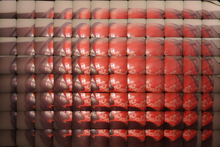
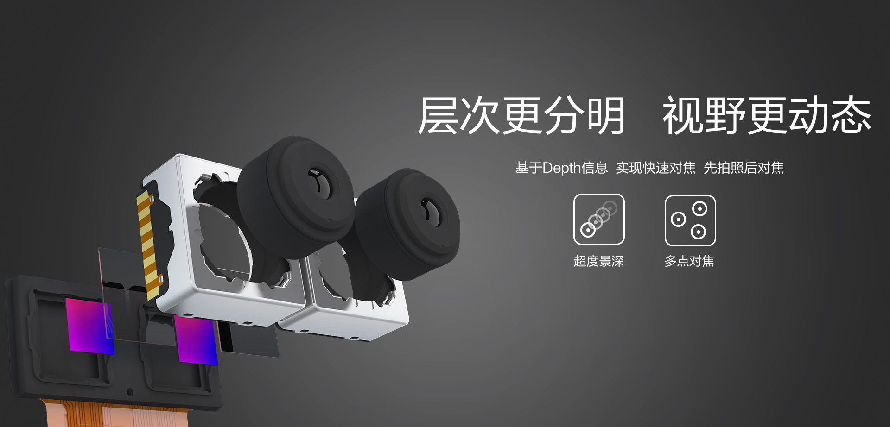
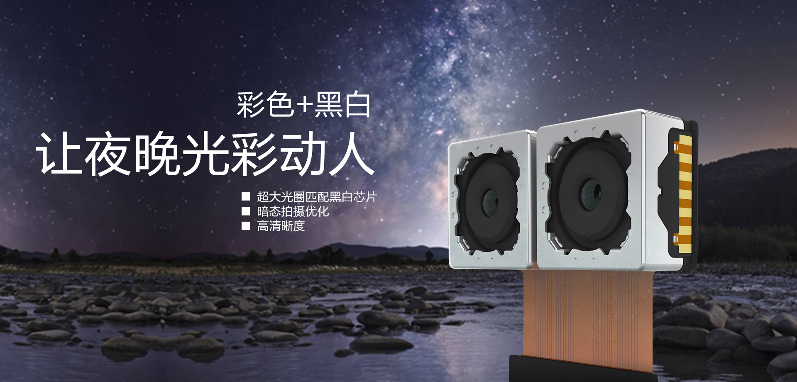
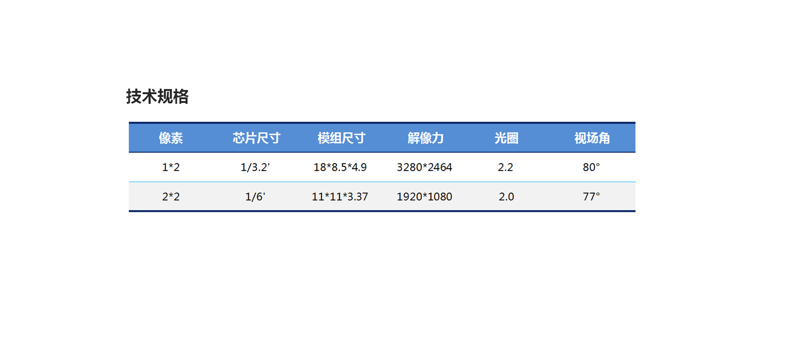
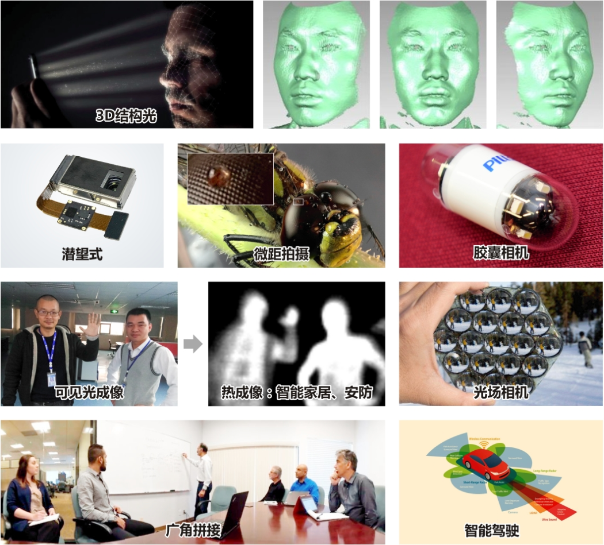
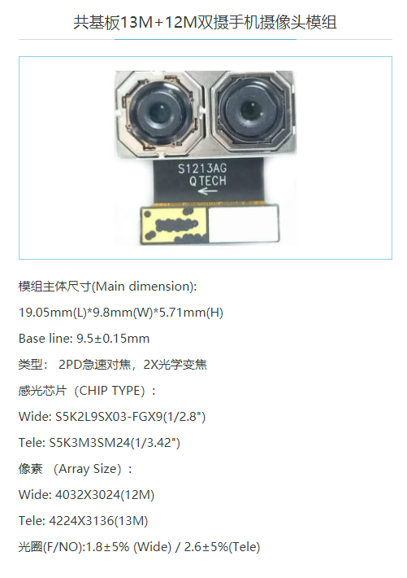
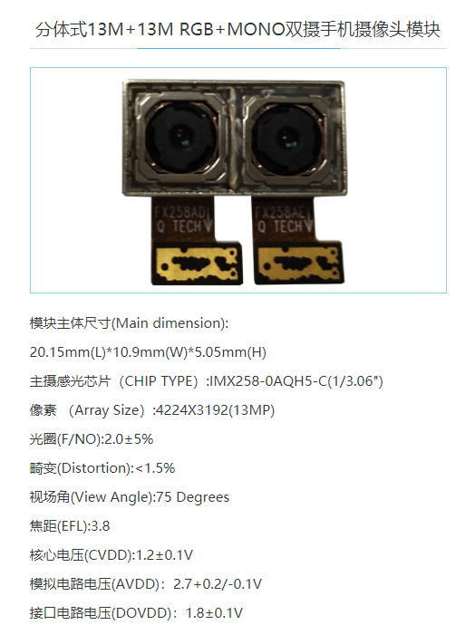

## 一些和毕设相关的思考，可能是有用的也可能是无用的

### 1. 关于多透镜阵列的问题

1. 在镜头后面加透镜阵列

   多透镜阵列的实质是为了得到视场差，进而类似于双目视觉系统得到特征点的三维空间信息。在进行多透镜阵列的搭建过程中发现，由于多透镜阵列之间的相互透光现象，导致各个成像之间的结果会相互影响。学长采用的是在原来的镜头后面放置透镜，根据计算可以知道前方透镜的焦距和光心位置，该透镜所成的像应该在光心后一定距离。此时，利用透镜阵列来对得到的像进行成像。如下图所示：

分析发现，如果想要在镜头后面加透镜阵列的话需要很长的距离，透镜1有3.5mm像距，此时透镜2有8mm的物距，加在一起就是11.5mm的距离，这在我们已有的镜头上面是实现不了的。而且这个镜头会非常长，不利于硬件系统的安装。

2. 去掉镜头直接利用透镜阵列成像

不能对人眼实现完全的成像，每次都只能成像一部分。

### 2. 关于透镜阵列的设想

透镜阵列应该尽量的满足我们的要求：首先成像的大小要大，其次成像的内容要

[迈得特光学](http://www.mdtp-optics.com/producta/?type=detail&id=15)

透镜阵列多孔径成像

[学长买透镜的地方](http://io.rayscience.com/product-314.html)

### 3.手机双摄模组的采用

[舜宇光学](http://www.sunnyoptical.com/001007009/p265.html)

[OFILM](http://www.ofilm.com/field_inner_19.html)

[丘钛科技](http://www.qtechglobal.com/product_info_2.html?page=1)

双摄模组有共基、一体和分体式三种

### 4. 关于眼纹特征的提取

在这里关于眼纹特征的提取过程中，拟采用神经网络的方式来实现对眼纹相交点大概位置的提取，然后对该点的区域进行截取，再次利用常规方法得到准确眼纹相关点准确位置。并在此时对眼纹的描述子进行计算，实现多图中眼纹特征的采集。

