前言**

由于毕设没有地方进行基本的记录，纸质记录容易出现丢失，为此记录在这里。

# 1. 眼图的处理

目前由于学长没有给我一个比较好的硬件系统，在没有这个硬件的时候是很难得到我们想要的眼图的，为此只能暂时先用网络上包含有眼纹的图形来进行相关的处理，为后面进行实际的操作打下一定的基础。
（眼图如下）目的：得到比较好的眼纹特征


1. 配置环境，vs2017+opencv3.3

   出现问题：无法打开msvcrtd.lib等错误

   参考：https://blog.csdn.net/huntercao/article/details/84555201

   

   成功解决

2. vs2017+opencv3.3配置

   参考：https://blog.csdn.net/marco2018/article/details/79430587

   对opencv成功实现了配置，并读出图形。

   

3. 安装image watch，

   参考：https://www.cnblogs.com/wjy-lulu/p/6952540.html

   需要在工具-扩展和更新-进行搜索image watch安装方可

4. 图像预处理：

   图像增强与滤波参考：https://www.cnblogs.com/jukan/p/7815722.html

# 2. 学长的预处理代码

学长原始代码的保存路径：`E:\研二上\单摄像机跟踪\单摄像机跟踪`

## 2.1 预处理过程展示

在拿到学长的代码之后对学长预处理的代码进行了调试，下面将会将学长的代码得到的中间结果等进行记录
原始图像


进行一定的操作和提取之后得到的图像


Cr通道的图像


对cr通道去除眉毛，高光等，局部Otsu之后


进行最大轮廓提取和形态学操作之后得到，并进行图像和模糊`imageblur`函数


再次得到掩图


进行gabor变换后


绿色通道的结果


利用归一化盒子进行模糊（问题，这里为什么要进行模糊 处理，以及模糊处理在图像处理中的用处是什么）


对该图像进行局部二值化操作得到

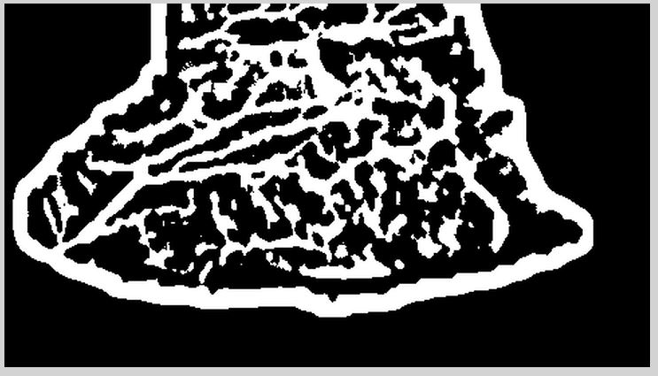

进行细化的结果

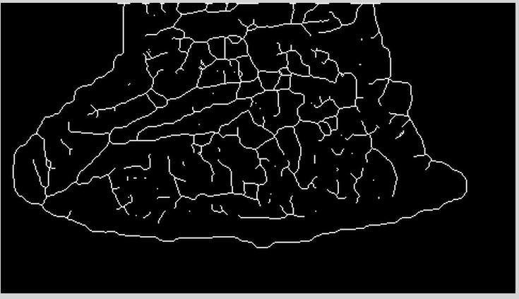

对PointLabel进行模糊，暂时不知道什么意思

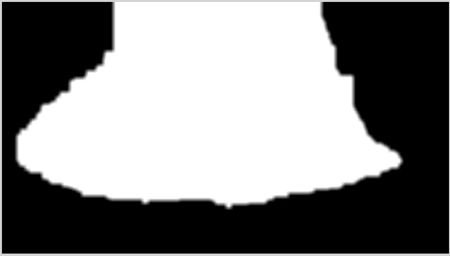

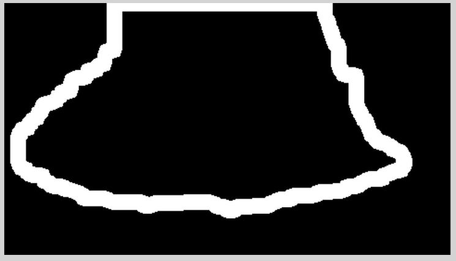

二值化后的图像减去高光区域和边缘区域得到的结果图

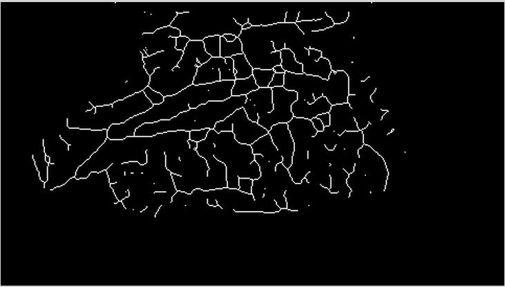

对该眼纹图像进行求轮廓的操作，取面积大于300的眼纹作为大眼纹。该方法并不是提取眼纹的好方法，在选取显著眼纹的时候应该是在进行细化之前对显著眼纹进行提取。

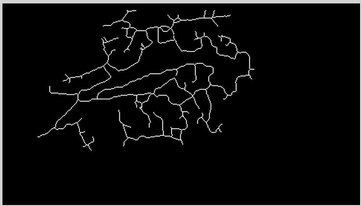

学长的标定代码中并没有对具体的图像数据的操作过程，只是将3张图像保存了起来，没有后续的操作内容。而且学长的代码是基于将视频拍摄下来后离线对视频进行处理，每个标定点采取一个视频序列

## 2.2 学长的数据处理代码

1. 标定：加载标定图像保存在result中

   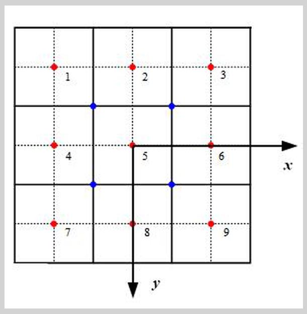

在对标定图进行大小resize之后将九个标定点的位置保存在```t[9][2]```中，但是这里对学长给出数据中的具体位置进行分析发现，学长的t数组的坐标并不完全是标定点的中心。如下圈中为t中的一个值

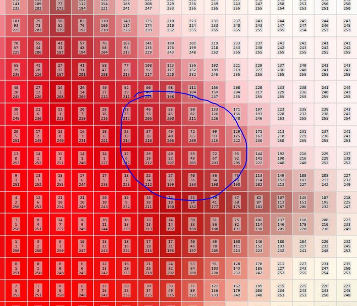

读取眼图：

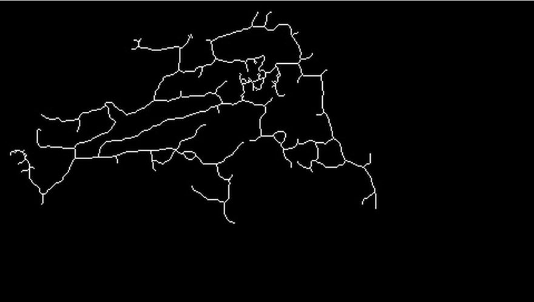计算该眼图中的各种描述子，如最小二乘，Hu描述子等保存在descriptor1中，并计算出所有眼纹的端点保存在descript1中


对视频进行标定操作：读入采集的视频图像，并对9个标定点的视频序列进行遍历，计算出每一帧的描述子和端点值，并将每一帧的描述子和端点值与开始给出的descriptor1，descript1进行匹配。利用两个图形得到的描述子之间的匹配关系来实现对两幅图像中匹配轮廓和相应直线的提取，以1图为基准，计算出两幅图像之间的差距，以此差距来实现视线结果的多项式拟合(这里的提取方法是进行遍历搜索，一旦满足要求就退出遍历循环，可能会得不到最佳匹配结果)：

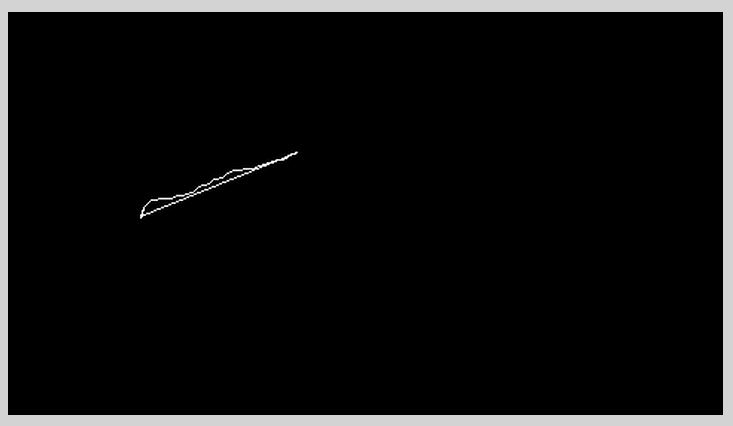

并据此得到两个图像直接的变换关系，并描述出来

```cpp
// 这里的x1和y1分别表示两个描述子对应的轮廓大小，索引10和11分别表示x，y坐标值
deltax = depict1[x1].at(10) - depict2[y1].at(10);
deltay = depict1[x1].at(11) - depict2[y1].at(11);

int x = j + deltax + 0.5;
int y = i + deltay + 0.5;

if (x >= 0 && y >= 0 && x < bianhuan0.cols && y < bianhuan0.rows)
{

    uchar* iData = bianhuan0.ptr<uchar>(y);

    iData[x] = src2.ptr<uchar>(i)[j];

}
```

并将变化后的图像和基准图像同时进行绘制。红色为基准图像，蓝色为此时的眼纹图像

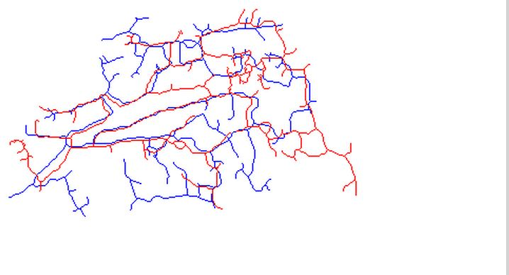

拟合多项式如下：


```cpp
double t_x, t_y;

t_x = t_y = 0;

//这里的参数是怎么得出来的？？
t_x = 0 + deltax* (-0.0206) + 0.6127*deltay + 0.0104*deltax*deltax + (-0.0144)*deltax*deltay + 0.0057*deltay*deltay + (-0.0011)*deltax*deltax*deltay + 0.0014*deltax*deltay*deltay + (-0.0001)*deltax*deltax*deltay*deltay;

t_y = 0 + deltax*0.3268+ (-0.3161)*deltay + 0.0156*deltax*deltax + (-0.0052)*deltax*deltay + 0.0074*deltay*deltay + (-0.0008)*deltax*deltax*deltay + (-0.0022)*deltax*deltay*deltay + (-0.0001)*deltax*deltax*deltay*deltay;

// 下面计算和真实值之间的差异？？
double t[9][2] = { { -5, -5 }, { 0, -5 }, { 5, -5 }, { -5, 0 }, { 0, 0 }, { 0, 5 }, { -5, 5 }, { 0, 5 }, {5,5} };

t_x = t_x - t[n-1][0];

t_y = t_y - t[n-1][1];

p.x = t_x;

p.y = t_y;
```

## 2.3 硬件系统结构

眼部相机距离眼睛大约是1-2cm，眼睛部分大小为$3*1.5cm$，焦距大约$3mm$

摄像机标定：消除摄像头畸变。世界坐标系$(x_w,y_w,z_w)$，相机坐标系$(x_c,y_c,z_c)$。

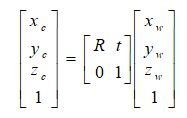

像素坐标系$(uov)$，图像坐标系$(XOY)$。


在相机坐标系下有小孔成像原理得


此时相机坐标系到图像坐标系的值为


至此，相机的公式为：


## 2.2代码中出现的问题

1. 内存溢出问题

`sort(contours.begin(), contours.end(), ContoursSortFun);`

问题报错：堆栈 Cookie 检测代码检测到基于堆栈的缓冲区溢出。有的时候进行编译又不会出现，这个问题后续再进行解决了。

考虑到contours的数目为1300+，可能是因为数组的数目过多导致内存的溢出。

2.Sift特征点检测，出现的未声明

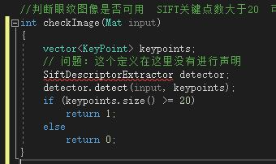

<font color=#00FF00>由于需要opencv_contrib中相关的函数，为此一开始百度发现需要进行cmake，在cmake完成之后发现生成的install文件夹在在解压的opencv文件夹下面存有，实际上该install文件夹就是进行完成cmake后的文件。无须自行进行cmake。</font>

~~针对该问题，在网上进行查找发现是由于基本的opencv中没有这些相关的库。在opencv3之后，这些库被放在opencv_contrib库中，需要进行cmake。~~

~~2.1 由于我在vs中进行编译的时候一直报opencv_dnn_modern中有外部命令无法解析，为此想在configuration的时候将opencv_dnn_modern选项取消，发现configuration的速度和generation的速度都上来了，open project进行vs重新进行编译。~~

~~2.2 但是此时在编译过程中发现并没有通过，报库损坏的错误，考虑是由于将一些共能取消之后不能生成完整的库。然后还是按照开始的方法进行configuration，虽然在vs进行编译的时候报i错了，但是报错为dnn相关的内容，而我不需要用这些内容，就暂时不管这个。右键install，仅对该文件进行生成。~~

~~2.3 此时会出现一个install的目录，就是我们需要的文件。按照之前的方式对该文件的一些内容进行配置，但是出现问题，就是原来的opencv存在一个opencv_world300d.lib库，但是这个时候却没有发现这个选项，可能是我这里的配置存在问题。但是既然这样就只能将lib目录下所有的库进行链接了。~~

~~2.4 接着运行的时候发现好多dll文件不能打开，而且在我进行环境变量的配置之后依然会报这些错误。百度之后，索性将所有的bin/\*.dll文件复制粘贴到windows/system32目录下,问题解决。~~

2.5 但是此时发现opencv2目录下并没有nonfree文件，百度发现在opencv3之后，相关文件都放在了xfeatures2d中`#include<opencv2/xfeatures2d/nonfree.hpp>`即可。而且sift特征点的提取如下

```
Ptr<Feature2D> detector = xfeatures2d::SIFT::create();
 detector->detect(input, keypoints);
```

至此，配置完成！！

[参考1](https://blog.csdn.net/u012456019/article/details/80589649)，[参考2](https://blog.csdn.net/qq_37791134/article/details/80739395)

注意：去github上下载和自己opencv版本相对应的opencv_contrib版本。在我这里进行配置的时候，

3.vs2017报错msvcrtd.lib等错误

[参考](https://blog.csdn.net/huntercao/article/details/84555201)：一开始的时候我采用第二种方法，因为我开始的时候只是在编译的时候出错，直接进行禁用就行了但是后来在我需要对opencv进行cmake的时候，configuration中选取的编译器是vs 2017，这导致在编译的过程中报错，说找不到CXX编译器，但是我明明都是有的，为此进入到cmake报错的文件中，发现竟然是报错msvcrtd.lib，也就是说这一步导致cmake不成功。只能对vs2017的QSpectre组件进行添加，采用第一种方法，完成之后重新进行cmake就行。

4. 代码缺失内容

1. 没有摄像头标定的程序，单目和双目摄像头参数标定的程序完全没有。

2. 没有标定多项式拟合过程参数的求解过程。

3. 没有对代码中很多的具体数值的含义进行明确。

4. 没有任何和双目相关的内容。

# 3. 双目相机的标定

[参考博客](https://www.cnblogs.com/zyly/p/9366080.html)

双目视觉主要包括相机标定、图形畸变矫正、摄像机矫正、图片匹配、3D恢复等


相机标定的两个目的

1. 还原摄像头成像的物体在真实世界的位置，即知道世界中的物体到计算机图像平面是如何进行变化的，相机标定的目的之一就是为了搞清楚这种变换关系，求解内外参数矩阵

2. 摄像机的透视投影有很大的畸变问题。另一个目的就是求解畸变系数，然后用于图像矫正。

## 3.1 坐标系

相机坐标系、世界坐标系、图像坐标系


世界坐标系$(x_w,y_w,z_w)$，相机坐标系$(x_c,y_c,z_c)$。世界坐标系到相机坐标系发生的是刚体变换，即旋转、平移的运动。公式中$R$表示旋转，$t$表示平移。


像素坐标系(以CCD图像平面的左上角顶点为坐标原点)$(XOY)$(uov)，图像坐标系(以CCD图像平面的中心为坐标原点)$(XOY)$。


其中$d_X、d_Y$分别表示每个像素在横轴x和纵轴y上的物理尺寸。$u_0,v_0$分别表示图像坐标系中心在像素坐标系中的位置。


在相机坐标系下有小孔成像原理得


此时相机坐标系到图像坐标系的值为，下面是学长给出来的公式，有明显的错误


至此，相机的公式为：


在网上找到公式


由于其次坐标的伸缩不变性，$Z_c[x,y,1]^T和(x,y,1)^T$表示同一个点。


## 3.2图片矫正

径向畸变：沿透镜半径方向分布的畸变，产生原因是光线在原理透镜中心的地方比靠近中心的地方更加弯曲，在普通廉价的镜头中表现明显。如下表示径向畸变中的桶行和枕形畸变。


像平面中心的畸变为0，沿着镜头半径的方向向边缘移动，畸变越来越严重。畸变的数学模型可以用主点周围的泰勒级数展开式的前几项进行表述，通常使用前两项，即$k1、k2$。


$(x0,y0)$是畸变点在像平面的原始位置，$(x,y)$是畸变矫正后新的位置。下图是距离光心不同距离上的点经过透镜径向畸变后点位的偏移示意图，可以看到，距离光心越远，径向位移越大，表示畸变也越大，在光心附近，几乎没有偏移。


切向畸变：由于透镜本身与相机传感器平面不平行产生的，多是由于透镜被粘贴到镜头模组上的安装偏差导致。畸变模型用两个额外的参数$p1,p2$来描述


下图显示某个透镜的切向畸变示意图，大体上畸变位移相对于左下——右上角的连线是对称的，说明该镜头在垂直于该方向上有一个旋转角度。


径向畸变和切向畸变模型中一共有5个畸变参数，在Opencv中他们被排列成一个5*1的矩阵，依次包含$k1,k2,p1,p2,k3$，被定义为Mat矩阵形式`Mat distCoeffs=Mat（1,5，CV_32FC1，Scalar::all（0））;`这5个参数就是相机标定中需要确定的相机的5个畸变系数。求得这5个参数后，就可以校正由于镜头畸变引起的图像的变形失真，下图显示根据镜头畸变系数校正后的效果。


## 3.3 张氏标定法

相机标定就是建立图像像素位置和物体空间位置之间的关系。根据已知特征点的坐标求解摄像机的模型参数，从而可以从图像出发恢复空间点的三维坐标。求解参数包含4个内参数、5个畸变参数、外部参数旋转矩阵和平移矩阵。

假定标定棋盘位置世界坐标系中$z_w=0$平面，简化公式如下


$u,v$是像素的坐标，$f_x=f/d_x,f_y=f/d_y,u_0,v_0,gama$表示相机5个内参,$R,T$表示相机外参，$x_w,y_w,z_w$表示世界坐标系中的坐标。

单应性（一个平面到另一个平面之间的投影映射）矩阵定义为：


有


H矩阵的求解：H是一个3\*3的矩阵，有一个元素作为齐次坐标，有8个未知量待解。至少需要8个方程，所以需要四个对应点，计算图像平面到世界平面的单应性矩阵H。

这是张氏标定采用四个角点的棋盘格作为标定物的一个原因，利用一张打印的棋盘格，然后对每个角点进行标记其在像素坐标系的像素点位置，以及在世界坐标系的坐标，张氏标定证明4组以上的点就可以求解初H矩阵的值，为减少误差，一般会拍摄许多张照片，选取大量的角点进行标定。

- 打印一张棋盘格标定图纸，将其贴在平面物体的表面

- 拍摄一组不同方向棋盘格的图片，可以通过移动相机来实现，也可以移动标定图片来实现

- 对于每张拍摄的棋盘图片，检测图片中所有棋盘格的特征点（角点，也就是下图中黑白棋盘交叉点，中间品红色的圆圈内就是一个角点）。我们定义打印的棋盘图纸位于世界坐标系zw=0的平面上，世界坐标系的原点位于棋盘图纸的固定一角（比如下图中黄色点）。像素坐标系原点位于图片左上角。

  

- 因为棋盘标定图纸中所有角点的空间坐标是已知的，这些角点对应在拍摄的标定图片中的角点的像素坐标也是已知的，如果我们得到这样的N>=4个匹配点对（越多计算结果越鲁棒），就可以根据LM等优化方法得到单应性矩阵H。

在实际标定过程中，一般使用最大似然估计进行优化。假设拍摄了n张标定图片，每张图片中有m个棋盘格角点。三维空间点$X_j(x_w,y_w,z_w)$经过相机内参M,外参R,t变换后得到二维像素为$x^`(u,v)$。假设噪声是独立同分布的，我们通过最小化$x_(ij)$（棋盘格角点在像素坐标系下的实际值），$x^`$（估计值）的位置来求解上述最大似然估计问题：


现在我们考虑透镜畸变的影响，由于径向畸变的影响相对较明显，所以主要考虑径向畸变参数，根据经验，通常只考虑径向畸变的前两个参数$k1,k2$就可以。实际求解中，通常把k1,k2也作为参数加入上述函数一起进行优化，待优化函数如下所示：


极大似然估计是一种估计总体未知参数的方法。它主要用于点估计问题。所谓点估计是指用一个估计量的观测值来估计未知参数的真值。说穿了就一句话：**就是在参数空间中选取使得样本取得观测值的概率最大的参数**。

## 3.4 opencv单目标定

**相机标定的目的**：获取摄像机的内参和外参矩阵（同时也会得到每一幅标定图像的选择和平移矩阵），内参和外参系数可以对之后相机拍摄的图像就进行矫正，得到畸变相对很小的图像。

**相机标定的输入**：标定图像上所有内角点的图像坐标，标定板图像上所有内角点的空间三维坐标（一般情况下假定图像位于Z=0平面上）。

**相机标定的输出**：摄像机的内参、外参系数。

这三个基础的问题就决定了使用Opencv实现张正友法标定相机的标定流程、标定结果评价以及使用标定结果矫正原始图像的完整流程：

- 1. 准备标定图片
- 2. 对每一张标定图片，提取角点信息
- 3.对每一张标定图片，进一步提取亚像素角点信息
- 4. 在棋盘标定图上绘制找到的内角点（非必须，仅为了显示）
- 5. 相机标定
- 6. 对标定结果进行评价
- 7. 查看标定效果——利用标定结果对棋盘图进行矫正

准备标定图片

标定图片需要使用标定板在不同位置、不同角度、不同姿态下拍摄，最少需要3张，以10~20张为宜。标定板需要是黑白相间的矩形构成的棋盘图，制作精度要求较高。

这里我们使用OpenCV提供的sample程序中的标定图片，图片位于opencv(C++版本)的安装路径：opencv\sources\samples\data下：

我们先创建一个C++控制台项目，并把标定图片按如下格式存放：

sample文件夹下有两个文件夹left和right，分别对应左摄像头和右摄像头拍摄到的标定板图片：

filename.txt存放标定图片的路径，内容如下：


关于OpenCV提供的用于相机标定的API函数可以查看博客[双目视觉标定程序讲解](https://www.cnblogs.com/polly333/p/5013505.html)，单目标定的代码如下：

```cpp
/*************************************************************************************
 *
 * Description：相机标定，张氏标定法 单目标定
 * Author ：JNU
 * Data ：2018.7.22
 *
 ************************************************************************************/
 #include <opencv2/core/core.hpp>
 #include <opencv2/imgproc/imgproc.hpp>
 #include <opencv2/calib3d/calib3d.hpp>
 #include <opencv2/highgui/highgui.hpp>
 #include <iostream>
 #include <fstream>
 #include <vector>
 using namespace cv;
 using namespace std;
 void main(char *args)
 {
 //保存文件名称
 std::vector<std::string> filenames;
 //需要更改的参数
 //左相机标定，指定左相机图片路径，以及标定结果保存文件
 string infilename = "sample/left/filename.txt"; //如果是右相机把left改为right
 string outfilename = "sample/left/caliberation_result.txt";
 //标定所用图片文件的路径,每一行保存一个标定图片的路径 ifstream 是从硬盘读到内存
 ifstream fin(infilename);
 //保存标定的结果 ofstream 是从内存写到硬盘
 ofstream fout(outfilename);
 /*
 1.读取毎一幅图像，从中提取出角点，然后对角点进行亚像素精确化、获取每个角点在像素坐标系中的坐标
 像素坐标系的原点位于图像的左上角
 */
 std::cout << "开始提取角点......" << std::endl;;
 //图像数量
 int imageCount = 0;
 //图像尺寸
 cv::Size imageSize;
 //标定板上每行每列的角点数
 cv::Size boardSize = cv::Size(9, 6);
 //缓存每幅图像上检测到的角点
 std::vector<Point2f> imagePointsBuf;
 //保存检测到的所有角点
 std::vector<std::vector<Point2f>> imagePointsSeq;
 char filename[100];
 if (fin.is_open())
 {
 //读取完毕？
 while (!fin.eof())
 {
 //一次读取一行
 fin.getline(filename, sizeof(filename) / sizeof(char));
 //保存文件名
 filenames.push_back(filename);
 //读取图片
 Mat imageInput = cv::imread(filename);
 //读入第一张图片时获取图宽高信息
 if (imageCount == 0)
 {
 imageSize.width = imageInput.cols;
 imageSize.height = imageInput.rows;
 std::cout << "imageSize.width = " << imageSize.width << std::endl;
 std::cout << "imageSize.height = " << imageSize.height << std::endl;
 }
 std::cout << "imageCount = " << imageCount << std::endl;
 imageCount++;
 //提取每一张图片的角点
 if (cv::findChessboardCorners(imageInput, boardSize, imagePointsBuf) == 0)
 {
 //找不到角点
 std::cout << "Can not find chessboard corners!" << std::endl;
 exit(1);
 }
 else
 {
 Mat viewGray;
 //转换为灰度图片
 cv::cvtColor(imageInput, viewGray, cv::COLOR_BGR2GRAY);
 //亚像素精确化 对粗提取的角点进行精确化
 cv::find4QuadCornerSubpix(viewGray, imagePointsBuf, cv::Size(5, 5));
 //保存亚像素点
 imagePointsSeq.push_back(imagePointsBuf);
 //在图像上显示角点位置
 cv::drawChessboardCorners(viewGray, boardSize, imagePointsBuf, true);
 //显示图片
 //cv::imshow("Camera Calibration", viewGray);
 cv::imwrite("test.jpg", viewGray);
 //等待0.5s
 //waitKey(500);
 }
 }
 //计算每张图片上的角点数 54
 int cornerNum = boardSize.width * boardSize.height;
 //角点总数
 int total = imagePointsSeq.size()*cornerNum;
 std::cout << "total = " << total << std::endl;
 for (int i = 0; i < total; i++)
 {
 int num = i / cornerNum;
 int p = i%cornerNum;
 //cornerNum是每幅图片的角点个数，此判断语句是 了输出，便于调试
 if (p == 0)
 {
 std::cout << "\n第 " << num+1 << "张图片的数据 -->: " << std::endl;
 }
 //输出所有的角点
 std::cout<<p+1<<":("<< imagePointsSeq[num][p].x;
 std::cout << imagePointsSeq[num][p].y<<")\t";
 if ((p+1) % 3 == 0)
 {
 std::cout << std::endl;
 }
 }
 std::cout << "角点提取完成!" << std::endl;
 /*
 2.摄像机标定 世界坐标系原点位于标定板左上角(第一个方格的左上角)
 */
 std::cout << "开始标定" << std::endl;
 //棋盘三维信息，设置棋盘在世界坐标系的坐标
 //实际测量得到标定板上每个棋盘格的大小
 cv::Size squareSize = cv::Size(26, 26);
 //毎幅图片角点数量
 std::vector<int> pointCounts;
 //保存标定板上角点的三维坐标
 std::vector<std::vector<cv::Point3f>> objectPoints;
 //摄像机内参数矩阵 M=[fx γ u0,0 fy v0,0 0 1]
 cv::Mat cameraMatrix = cv::Mat(3, 3, CV_64F, Scalar::all(0));
 //摄像机的5个畸变系数k1,k2,p1,p2,k3
 cv::Mat distCoeffs = cv::Mat(1, 5, CV_64F, Scalar::all(0));
 //每幅图片的旋转向量
 std::vector<cv::Mat> tvecsMat;
 //每幅图片的平移向量
 std::vector<cv::Mat> rvecsMat;
 //初始化标定板上角点的三维坐标
 int i, j, t;
 for (t = 0; t < imageCount; t++)
 {
 std::vector<cv::Point3f> tempPointSet;
 //行数
 for (i = 0; i < boardSize.height; i++)
 {
 //列数
 for (j = 0; j < boardSize.width; j++)
 {
 cv::Point3f realPoint;
 //假设标定板放在世界坐标系中z=0的平面上。
 realPoint.x = i*squareSize.width;
 realPoint.y = j*squareSize.height;
 realPoint.z = 0;
 tempPointSet.push_back(realPoint);
 }
 }
 objectPoints.push_back(tempPointSet);
 }
 //初始化每幅图像中的角点数量，假定每幅图像中都可以看到完整的标定板
 for (i = 0; i < imageCount; i++)
 {
 pointCounts.push_back(boardSize.width*boardSize.height);
 }
 //开始标定
 cv::calibrateCamera(objectPoints, imagePointsSeq, imageSize, cameraMatrix, distCoeffs, rvecsMat, tvecsMat);
 std::cout << "标定完成" << std::endl;
 //对标定结果进行评价
 std::cout << "开始评价标定结果......" << std::endl;
 //所有图像的平均误差的总和
 double totalErr = 0.0;
 //每幅图像的平均误差
 double err = 0.0;
 //保存重新计算得到的投影点
 std::vector<cv::Point2f> imagePoints2;
 std::cout << "每幅图像的标定误差:" << std::endl;
 fout << "每幅图像的标定误差:" << std::endl;
 for (i = 0; i < imageCount; i++)
 {
 std::vector<cv::Point3f> tempPointSet = objectPoints[i];
 //通过得到的摄像机内外参数，对空间的三维点进行重新投影计算，得到新的投影点imagePoints2（在像素坐标系下的点坐标）
 cv::projectPoints(tempPointSet, rvecsMat[i], tvecsMat[i], cameraMatrix, distCoeffs, imagePoints2);
 //计算新的投影点和旧的投影点之间的误差
 std::vector<cv::Point2f> tempImagePoint = imagePointsSeq[i];
 cv::Mat tempImagePointMat = cv::Mat(1, tempImagePoint.size(), CV_32FC2);
 cv::Mat imagePoints2Mat = cv::Mat(1, imagePoints2.size(), CV_32FC2);
 for (int j = 0; j < tempImagePoint.size(); j++)
 {
 imagePoints2Mat.at<cv::Vec2f>(0, j) = cv::Vec2f(imagePoints2[j].x, imagePoints2[j].y);
 tempImagePointMat.at<cv::Vec2f>(0, j) = cv::Vec2f(tempImagePoint[j].x, tempImagePoint[j].y);
 }
 //Calculates an absolute difference norm or a relative difference norm.
 err = cv::norm(imagePoints2Mat, tempImagePointMat, NORM_L2);
 totalErr += err /= pointCounts[i];
 std::cout << " 第" << i + 1 << "幅图像的平均误差：" << err << "像素" << endl;
 fout<< "第" << i + 1 << "幅图像的平均误差：" << err << "像素" << endl;
 }
 //每张图像的平均总误差
 std::cout << " 总体平均误差:" << totalErr / imageCount << "像素" << std::endl;
 fout << "总体平均误差:" << totalErr / imageCount << "像素" << std::endl;
 std::cout << "评价完成!" << std::endl;
 //保存标定结果
 std::cout << "开始保存标定结果....." << std::endl;
 //保存每张图像的旋转矩阵
 cv::Mat rotationMatrix = cv::Mat(3, 3, CV_32FC1, Scalar::all(0));
 fout << "相机内参数矩阵:" << std::endl;
 fout << cameraMatrix << std::endl << std::endl;
 fout << "畸变系数:" << std::endl;
 fout << distCoeffs << std::endl << std::endl;
 for (int i = 0; i < imageCount; i++)
 {
 fout << "第" << i + 1 << "幅图像的旋转向量:" << std::endl;
 fout << tvecsMat[i] << std::endl;
 //将旋转向量转换为相对应的旋转矩阵
 cv::Rodrigues(tvecsMat[i], rotationMatrix);
 fout << "第" << i + 1 << "幅图像的旋转矩阵:" << std::endl;
 fout << rotationMatrix << std::endl;
 fout << "第" << i + 1 << "幅图像的平移向量:" << std::endl;
 fout << rvecsMat[i] << std::endl;
 }
 std::cout << "保存完成" << std::endl;
 /************************************************************************
 显示定标结果
 *************************************************************************/
 cv::Mat mapx = cv::Mat(imageSize, CV_32FC1);
 cv::Mat mapy = cv::Mat(imageSize, CV_32FC1);
 cv::Mat R = cv::Mat::eye(3, 3, CV_32F);
 std::cout << "显示矫正图像" << endl;
 for (int i = 0; i != imageCount; i++)
 {
 std::cout << "Frame #" << i + 1 << "..." << endl;
 //计算图片畸变矫正的映射矩阵mapx、mapy(不进行立体校正、立体校正需要使用双摄)
 initUndistortRectifyMap(cameraMatrix, distCoeffs, R, cameraMatrix, imageSize, CV_32FC1, mapx, mapy);
 //读取一张图片
 Mat imageSource = imread(filenames[i]);
 Mat newimage = imageSource.clone();
 //另一种不需要转换矩阵的方式
 //undistort(imageSource,newimage,cameraMatrix,distCoeffs);
 //进行校正
 remap(imageSource, newimage, mapx, mapy, INTER_LINEAR);
 imshow("原始图像", imageSource);
 imshow("矫正后图像", newimage);
 waitKey();
 }
 //释放资源
 fin.close();
 fout.close();
 system("pause");
 }
 }
```

上面有两个函数需要单独介绍一下：

```cpp
CV_EXPORTS_W void initUndistortRectifyMap( InputArray cameraMatrix, InputArray distCoeffs,
                           InputArray R, InputArray newCameraMatrix,
                           Size size, int m1type, OutputArray map1, OutputArray map2 );
```

**函数功能：**该函数功能是计算畸变矫正和摄像机立体校正的映射变换矩阵。为了重映射，将结果以映射的形式表达。无畸变的图像看起来和原始的图像一样，就像这个图像是用内参为`newCameraMatrix`的且无畸变的相机采集得到的。该函数实际上为反向映射算法构建映射，供反向映射使用。也就是，对于已经修正畸变的图像中的每个像素(u,v)，该函数计算原来图像（从相机中获得的原始图像）中对应的坐标系。

****参数说明：****

- `cameraMatrix`：输入相机内参矩阵


- `distCoeffs`：输入参数，相机的畸变系数


有4，5,8,12或14个元素。如果这个向量是空的，就认为是零畸变系数。

- `R`：可选的立体修正变换矩阵，是个3*3的矩阵。

在单目相机例子中，R就设置为单位矩阵cv::Mat R = cv::Mat::eye(3, 3, CV_32F)，表示不进行立体校正。

在双目相机例子中，`newCameraMatrix`一般是用`cv::stereoRectify()`计算而来的，设置为R1或R2(左右相机平面行对准的校正旋转矩阵)。此外，根据R，新的相机在坐标空间中的取向是不同的。例如，它帮助配准双目相机的两个相机方向，从而使得两个图像的极线是水平的，且y坐标相同（在双目相机的两个相机谁水平放置的情况下）。

- `newCameraMatrix`：新的相机内参矩阵


在单目相机例子中，`newCameraMatrix`一般和`cameraMatrix`相等，或者可以用`cv::getOptimalNewCameraMatrix()`来计算，获得一个更好的有尺度的控制结果。

在双目相机例子中，`newCameraMatrix`一般是用`cv::stereoRectify()`计算而来的，设置为P1或P2(左右相机把空间3D点的坐标转换到图像的2D点的坐标的投影矩阵)。

- `size`：未畸变的图像尺寸。
- .`m1type`：第一个输出的映射的类型，可以为 CV_32FC1, CV_32FC2或CV_16SC2，参见`cv::convertMaps`。
- .`map1`：第一个输出映射。
- .`map2`：第二个输出映射。

void remap(InputArray src, OutputArray dst, InputArray map1, InputArray 
　　　　　　map2, int interpolation,int borderMode=BORDER_CONSTANT, const Scalar& borderValue=Scalar())

**函数功能：**重映射：就是把一幅图像中某位置的像素放置到另一个图片指定位置的过程。

****参数说明：****

- src：输入图像，即原图像，需要单通道8位或者浮点类型的图像

- dst：输出图像，即目标图像，需和原图形一样的尺寸和类型

- map1：它有两种可能表示的对象：（1）表示点（x,y）的第一个映射；（2）表示CV_16SC2，CV_32FC1等

- map2：它有两种可能表示的对象：（1）若map1表示点（x,y）时，这个参数不代表任何值；（2）表示CV_16UC1，CV_32FC1类型的Y值

- interpolation：插值方式，有四中插值方式：

（1）INTER_NEAREST——最近邻插值

（2）INTER_LINEAR——双线性插值（默认）

（3）INTER_CUBIC——双三样条插值（默认）

（4）INTER_LANCZOS4——lanczos插值（默认）

- borderMode：边界模式，默认BORDER_CONSTANT
- borderValue：边界颜色，默认Scalar()黑色

## 3.5 双目相机标定

[参考博客](https://www.cnblogs.com/lyx2018/p/7103612.html)

单目相机标定的目标是获取相机的内参和外参，内参（1/dx,1/dy,Cx,Cy,f）表征了相机的内部结构参数，外参是相机的旋转矩阵R和平移向量t。内参中dx和dy是相机单个感光单元芯片的长度和宽度，是一个物理尺寸，有时候会有dx=dy，这时候感光单元是一个正方形。Cx和Cy分别代表相机感光芯片的中心点在x和y方向上可能存在的偏移，因为芯片在安装到相机模组上的时候，由于制造精度和组装工艺的影响，很难做到中心完全重合。f代表相机的焦距。

双目标定的第一步需要分别获取左右相机的内外参数，之后通过立体标定对左右两幅图像进行立体校准和对齐，最后就是确定两个相机的相对位置关系，即中心距。

首先看一下双目测距的基本原理：


假设有一个点p，沿着垂直于相机中心连线方向上下移动，则其在左右相机上的成像点的位置会不断变化，即d=x1-x2的大小不断变化，并且点p和相机之间的距离Z跟视差d存在着反比关系。上式中视差d可以通过两个相机中心距T减去p点分别在左右图像上的投影点偏离中心点的值获得，所以只要获取到了两个相机的中心距T,就可以评估出p点距离相机的距离，这个中心距T也是双目标定中需要确立的参数之一。

当然这一切有一个前提就是要在两个相机成像上定位到同一个点p上，就是要把左右两个图片的点匹配起来，这就涉及到双目校正的动作。如果通过一幅图片上一个点的特征在另一个二维图像空间上匹配对应点，这个过程会非常耗时。为了减少匹配搜索的运算量，我们可以利用极限约束使得对应点的匹配由二维搜索空间降到一维搜索空间。

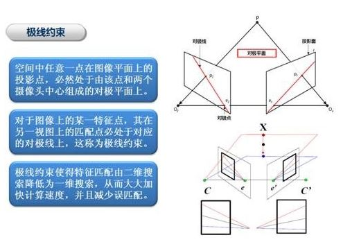

这时候要用双目校正把消除畸变后的两幅图像在水平方向严格的对齐，使得两幅图像的对极线恰好在同一水平线上，这样一幅图像上任意一点与其在另一幅图像上的匹配点就必然具有相同的行号，只需要在该行进行一维搜索就可匹配到对应点。

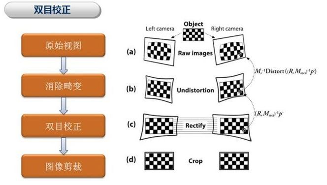

下边Opencv双目相机校正的代码是在自带的程序stereo_calib.cpp基础上修改的，位置在“XX\opencv\sources\samples\cpp\”，使用时拷贝目录下的26张图片和stereo_calib.xml到当前工程目录下，并在工程调试->命令参数里设置参数为：StereoCalibration -w 9 -h 6 stereo_calib.xml

```cpp
#include "opencv2/calib3d/calib3d.hpp"
#include "opencv2/highgui/highgui.hpp"
#include "opencv2/imgproc/imgproc.hpp"

#include <vector>
#include <string>
#include <algorithm>
#include <iostream>
#include <iterator>
#include <stdio.h>
#include <stdlib.h>
#include <ctype.h>

using namespace cv;
using namespace std;

static void StereoCalib(const vector<string>& imagelist, Size boardSize, bool useCalibrated=true, bool showRectified=true)
{
    if( imagelist.size() % 2 != 0 )
    {
        cout << "Error: the image list contains odd (non-even) number of elements\n";
        return;
    }

    bool displayCorners = true;//true;
    const int maxScale = 2;
    const float squareSize = 1.f;  // Set this to your actual square size
    // ARRAY AND VECTOR STORAGE:

    vector<vector<Point2f> > imagePoints[2];
    vector<vector<Point3f> > objectPoints;
    Size imageSize;

    int i, j, k, nimages = (int)imagelist.size()/2;

    imagePoints[0].resize(nimages);
    imagePoints[1].resize(nimages);
    vector<string> goodImageList;

    for( i = j = 0; i < nimages; i++ )
    {
        for( k = 0; k < 2; k++ )
        {
            const string& filename = imagelist[i*2+k];
            Mat img = imread(filename, 0);
            if(img.empty())
                break;
            if( imageSize == Size() )
                imageSize = img.size();
            else if( img.size() != imageSize )
            {
                cout << "The image " << filename << " has the size different from the first image size. Skipping the pair\n";
                break;
            }
            bool found = false;
            vector<Point2f>& corners = imagePoints[k][j];
            for( int scale = 1; scale <= maxScale; scale++ )
            {
                Mat timg;
                if( scale == 1 )
                    timg = img;
                else
                    resize(img, timg, Size(), scale, scale);
                found = findChessboardCorners(timg, boardSize, corners,
                    CV_CALIB_CB_ADAPTIVE_THRESH | CV_CALIB_CB_NORMALIZE_IMAGE);
                if( found )
                {
                    if( scale > 1 )
                    {
                        Mat cornersMat(corners);
                        cornersMat *= 1./scale;
                    }
                    break;
                }
            }
            if( displayCorners )
            {
                cout << filename << endl;
                Mat cimg, cimg1;
                cvtColor(img, cimg, COLOR_GRAY2BGR);
                drawChessboardCorners(cimg, boardSize, corners, found);
                double sf = 640./MAX(img.rows, img.cols);
                resize(cimg, cimg1, Size(), sf, sf);
                imshow("corners", cimg1);                
                char c = (char)waitKey(500);
                if( c == 27 || c == 'q' || c == 'Q' ) //Allow ESC to quit
                    exit(-1);
            }
            else
                putchar('.');
            if( !found )
                break;
            cornerSubPix(img, corners, Size(11,11), Size(-1,-1),
                TermCriteria(CV_TERMCRIT_ITER+CV_TERMCRIT_EPS,
                30, 0.01));
        }
        if( k == 2 )
        {
            goodImageList.push_back(imagelist[i*2]);
            goodImageList.push_back(imagelist[i*2+1]);
            j++;
        }
    }
    cout << j << " pairs have been successfully detected.\n";
    nimages = j;
    if( nimages < 2 )
    {
        cout << "Error: too little pairs to run the calibration\n";
        return;
    }

    imagePoints[0].resize(nimages);
    imagePoints[1].resize(nimages);
    objectPoints.resize(nimages);

    for( i = 0; i < nimages; i++ )
    {
        for( j = 0; j < boardSize.height; j++ )
            for( k = 0; k < boardSize.width; k++ )
                objectPoints[i].push_back(Point3f(k*squareSize, j*squareSize, 0));
    }

    cout << "Running stereo calibration ...\n";

    Mat cameraMatrix[2], distCoeffs[2];
    cameraMatrix[0] = Mat::eye(3, 3, CV_64F);
    cameraMatrix[1] = Mat::eye(3, 3, CV_64F);
    Mat R, T, E, F;

    double rms = stereoCalibrate(objectPoints, imagePoints[0], imagePoints[1],
        cameraMatrix[0], distCoeffs[0],
        cameraMatrix[1], distCoeffs[1],
        imageSize, R, T, E, F,
        TermCriteria(CV_TERMCRIT_ITER+CV_TERMCRIT_EPS, 100, 1e-5),
        CV_CALIB_FIX_ASPECT_RATIO +
        CV_CALIB_ZERO_TANGENT_DIST +
        CV_CALIB_SAME_FOCAL_LENGTH +
        CV_CALIB_RATIONAL_MODEL +
        CV_CALIB_FIX_K3 + CV_CALIB_FIX_K4 + CV_CALIB_FIX_K5);
    cout << "done with RMS error=" << rms << endl;

    // CALIBRATION QUALITY CHECK
    // because the output fundamental matrix implicitly
    // includes all the output information,
    // we can check the quality of calibration using the
    // epipolar geometry constraint: m2^t*F*m1=0
    double err = 0;
    int npoints = 0;
    vector<Vec3f> lines[2];
    for( i = 0; i < nimages; i++ )
    {
        int npt = (int)imagePoints[0][i].size();
        Mat imgpt[2];
        for( k = 0; k < 2; k++ )
        {
            imgpt[k] = Mat(imagePoints[k][i]);
            undistortPoints(imgpt[k], imgpt[k], cameraMatrix[k], distCoeffs[k], Mat(), cameraMatrix[k]);
            computeCorrespondEpilines(imgpt[k], k+1, F, lines[k]);
        }
        for( j = 0; j < npt; j++ )
        {
            double errij = fabs(imagePoints[0][i][j].x*lines[1][j][0] +
                imagePoints[0][i][j].y*lines[1][j][1] + lines[1][j][2]) +
                fabs(imagePoints[1][i][j].x*lines[0][j][0] +
                imagePoints[1][i][j].y*lines[0][j][1] + lines[0][j][2]);
            err += errij;
        }
        npoints += npt;
    }
    cout << "average reprojection err = " <<  err/npoints << endl;

    // save intrinsic parameters
    FileStorage fs("intrinsics.yml", CV_STORAGE_WRITE);
    if( fs.isOpened() )
    {
        fs << "M1" << cameraMatrix[0] << "D1" << distCoeffs[0] <<
            "M2" << cameraMatrix[1] << "D2" << distCoeffs[1];
        fs.release();
    }
    else
        cout << "Error: can not save the intrinsic parameters\n";

    Mat R1, R2, P1, P2, Q;
    Rect validRoi[2];

    stereoRectify(cameraMatrix[0], distCoeffs[0],
        cameraMatrix[1], distCoeffs[1],
        imageSize, R, T, R1, R2, P1, P2, Q,
        CALIB_ZERO_DISPARITY, 1, imageSize, &validRoi[0], &validRoi[1]);

    fs.open("extrinsics.yml", CV_STORAGE_WRITE);
    if( fs.isOpened() )
    {
        fs << "R" << R << "T" << T << "R1" << R1 << "R2" << R2 << "P1" << P1 << "P2" << P2 << "Q" << Q;
        fs.release();
    }
    else
        cout << "Error: can not save the extrinsic parameters\n";

    // OpenCV can handle left-right
    // or up-down camera arrangements
    bool isVerticalStereo = fabs(P2.at<double>(1, 3)) > fabs(P2.at<double>(0, 3));

    // COMPUTE AND DISPLAY RECTIFICATION
    if( !showRectified )
        return;

    Mat rmap[2][2];
    // IF BY CALIBRATED (BOUGUET'S METHOD)
    if( useCalibrated )
    {
        // we already computed everything
    }
    // OR ELSE HARTLEY'S METHOD
    else
        // use intrinsic parameters of each camera, but
        // compute the rectification transformation directly
        // from the fundamental matrix
    {
        vector<Point2f> allimgpt[2];
        for( k = 0; k < 2; k++ )
        {
            for( i = 0; i < nimages; i++ )
                std::copy(imagePoints[k][i].begin(), imagePoints[k][i].end(), back_inserter(allimgpt[k]));
        }
        F = findFundamentalMat(Mat(allimgpt[0]), Mat(allimgpt[1]), FM_8POINT, 0, 0);
        Mat H1, H2;
        stereoRectifyUncalibrated(Mat(allimgpt[0]), Mat(allimgpt[1]), F, imageSize, H1, H2, 3);

        R1 = cameraMatrix[0].inv()*H1*cameraMatrix[0];
        R2 = cameraMatrix[1].inv()*H2*cameraMatrix[1];
        P1 = cameraMatrix[0];
        P2 = cameraMatrix[1];
    }

    //Precompute maps for cv::remap()
    initUndistortRectifyMap(cameraMatrix[0], distCoeffs[0], R1, P1, imageSize, CV_16SC2, rmap[0][0], rmap[0][1]);
    initUndistortRectifyMap(cameraMatrix[1], distCoeffs[1], R2, P2, imageSize, CV_16SC2, rmap[1][0], rmap[1][1]);

    Mat canvas;
    double sf;
    int w, h;
    if( !isVerticalStereo )
    {
        sf = 600./MAX(imageSize.width, imageSize.height);
        w = cvRound(imageSize.width*sf);
        h = cvRound(imageSize.height*sf);
        canvas.create(h, w*2, CV_8UC3);
    }
    else
    {
        sf = 300./MAX(imageSize.width, imageSize.height);
        w = cvRound(imageSize.width*sf);
        h = cvRound(imageSize.height*sf);
        canvas.create(h*2, w, CV_8UC3);
    }

    for( i = 0; i < nimages; i++ )
    {
        for( k = 0; k < 2; k++ )
        {
            Mat img = imread(goodImageList[i*2+k], 0), rimg, cimg;
            remap(img, rimg, rmap[k][0], rmap[k][1], CV_INTER_LINEAR);
            imshow("单目相机校正",rimg);
            waitKey();
            cvtColor(rimg, cimg, COLOR_GRAY2BGR);
            Mat canvasPart = !isVerticalStereo ? canvas(Rect(w*k, 0, w, h)) : canvas(Rect(0, h*k, w, h));
            resize(cimg, canvasPart, canvasPart.size(), 0, 0, CV_INTER_AREA);
            if( useCalibrated )
            {
                Rect vroi(cvRound(validRoi[k].x*sf), cvRound(validRoi[k].y*sf),
                    cvRound(validRoi[k].width*sf), cvRound(validRoi[k].height*sf));
                rectangle(canvasPart, vroi, Scalar(0,0,255), 3, 8);
            }
        }

        if( !isVerticalStereo )
            for( j = 0; j < canvas.rows; j += 16 )
                line(canvas, Point(0, j), Point(canvas.cols, j), Scalar(0, 255, 0), 1, 8);
        else
            for( j = 0; j < canvas.cols; j += 16 )
                line(canvas, Point(j, 0), Point(j, canvas.rows), Scalar(0, 255, 0), 1, 8);
        imshow("双目相机校正对齐", canvas);
        waitKey();
        char c = (char)waitKey();
        if( c == 27 || c == 'q' || c == 'Q' )
            break;
    }
}


static bool readStringList( const string& filename, vector<string>& l )
{
    l.resize(0);
    FileStorage fs(filename, FileStorage::READ);
    if( !fs.isOpened() )
        return false;
    FileNode n = fs.getFirstTopLevelNode();
    if( n.type() != FileNode::SEQ )
        return false;
    FileNodeIterator it = n.begin(), it_end = n.end();
    for( ; it != it_end; ++it )
        l.push_back((string)*it);
    return true;
}

int main(int argc, char** argv)
{
    Size boardSize;
    string imagelistfn;
    bool showRectified = true;

    for( int i = 1; i < argc; i++ )
    {
        if( string(argv[i]) == "-w" )
        {
            if( sscanf(argv[++i], "%d", &boardSize.width) != 1 || boardSize.width <= 0 )
            {
                cout << "invalid board width" << endl;
                return -1;
            }
        }
        else if( string(argv[i]) == "-h" )
        {
            if( sscanf(argv[++i], "%d", &boardSize.height) != 1 || boardSize.height <= 0 )
            {
                cout << "invalid board height" << endl;
                return -1;
            }
        }
        else if( string(argv[i]) == "-nr" )
            showRectified = false;
        else if( string(argv[i]) == "--help" )
            return -1;
        else if( argv[i][0] == '-' )
        {
            cout << "invalid option " << argv[i] << endl;
            return 0;
        }
        else
            imagelistfn = argv[i];
    }

    if( imagelistfn == "" )
    {
        imagelistfn = "stereo_calib.xml";
        boardSize = Size(9, 6);
    }
    else if( boardSize.width <= 0 || boardSize.height <= 0 )
    {
        cout << "if you specified XML file with chessboards, you should also specify the board width and height (-w and -h options)" << endl;
        return 0;
    }

    vector<string> imagelist;
    bool ok = readStringList(imagelistfn, imagelist);
    if(!ok || imagelist.empty())
    {
        cout << "can not open " << imagelistfn << " or the string list is empty" << endl;
        return -1;
    }

    StereoCalib(imagelist, boardSize, true, showRectified);
    return 0;
}
```

右相机其中一个标定图片查找到的角点：

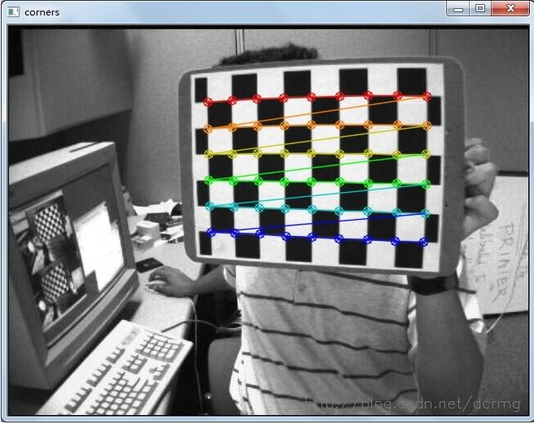

左相机其中一个标定图片查找到的角点：

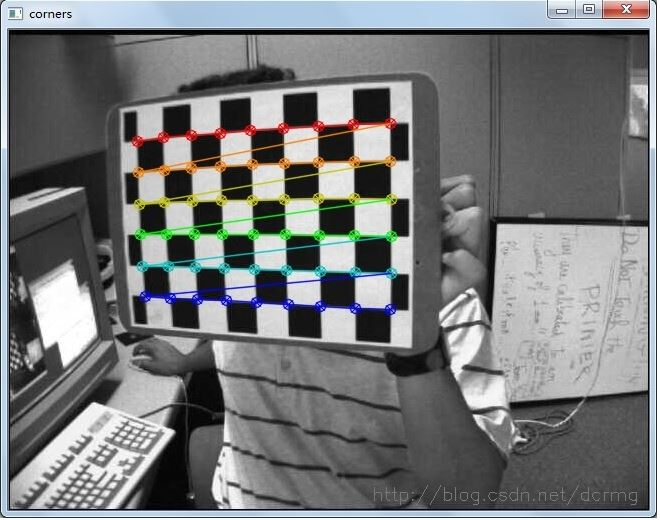

右相机单目校正：

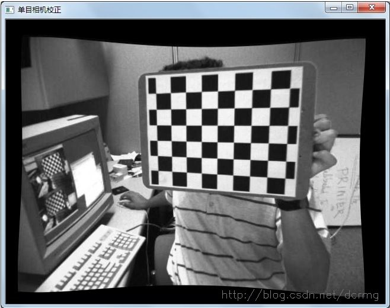

左相机单目校正：

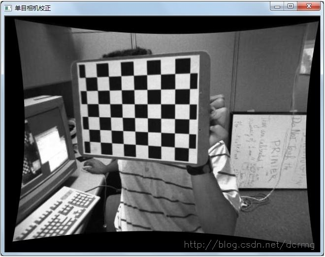

左右相机双目立体校正：

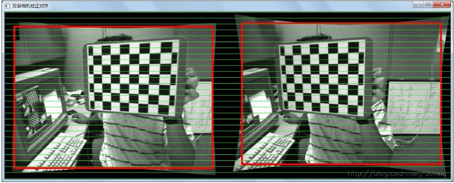

双目相机标定后，可以看到左右相机对应匹配点基本上已经水平对齐。

之后在该程序基础上运行stereo_match.cpp，求左右相机的视差。同样工程调试->命令参数里设置参数为：left01.jpg right01.jpg --algorithm=bm -i intrinsics.yml -e extrinsics.yml：

```cpp
#include "opencv2/calib3d/calib3d.hpp"
#include "opencv2/imgproc/imgproc.hpp"
#include "opencv2/highgui/highgui.hpp"
#include "opencv2/contrib/contrib.hpp"

#include <stdio.h>

using namespace cv;

static void saveXYZ(const char* filename, const Mat& mat)
{
    const double max_z = 1.0e4;
    FILE* fp = fopen(filename, "wt");
    for(int y = 0; y < mat.rows; y++)
    {
        for(int x = 0; x < mat.cols; x++)
        {
            Vec3f point = mat.at<Vec3f>(y, x);
            if(fabs(point[2] - max_z) < FLT_EPSILON || fabs(point[2]) > max_z) continue;
            fprintf(fp, "%f %f %f\n", point[0], point[1], point[2]);
        }
    }
    fclose(fp);
}

int main(int argc, char** argv)
{
    const char* algorithm_opt = "--algorithm=";
    const char* maxdisp_opt = "--max-disparity=";
    const char* blocksize_opt = "--blocksize=";
    const char* nodisplay_opt = "--no-display";
    const char* scale_opt = "--scale=";

    if(argc < 3)
    {
        return 0;
    }
    const char* img1_filename = 0;
    const char* img2_filename = 0;
    const char* intrinsic_filename = 0;
    const char* extrinsic_filename = 0;
    const char* disparity_filename = 0;
    const char* point_cloud_filename = 0;

    enum { STEREO_BM=0, STEREO_SGBM=1, STEREO_HH=2, STEREO_VAR=3 };
    int alg = STEREO_SGBM;
    int SADWindowSize = 0, numberOfDisparities = 0;
    bool no_display = false;
    float scale = 1.f;

    StereoBM bm;
    StereoSGBM sgbm;
    StereoVar var;

    for( int i = 1; i < argc; i++ )
    {
        if( argv[i][0] != '-' )
        {
            if( !img1_filename )
                img1_filename = argv[i];
            else
                img2_filename = argv[i];
        }
        else if( strncmp(argv[i], algorithm_opt, strlen(algorithm_opt)) == 0 )
        {
            char* _alg = argv[i] + strlen(algorithm_opt);
            alg = strcmp(_alg, "bm") == 0 ? STEREO_BM :
                  strcmp(_alg, "sgbm") == 0 ? STEREO_SGBM :
                  strcmp(_alg, "hh") == 0 ? STEREO_HH :
                  strcmp(_alg, "var") == 0 ? STEREO_VAR : -1;
            if( alg < 0 )
            {
                printf("Command-line parameter error: Unknown stereo algorithm\n\n");
                return -1;
            }
        }
        else if( strncmp(argv[i], maxdisp_opt, strlen(maxdisp_opt)) == 0 )
        {
            if( sscanf( argv[i] + strlen(maxdisp_opt), "%d", &numberOfDisparities ) != 1 ||
                numberOfDisparities < 1 || numberOfDisparities % 16 != 0 )
            {
                printf("Command-line parameter error: The max disparity (--maxdisparity=<...>) must be a positive integer divisible by 16\n");

                return -1;
            }
        }
        else if( strncmp(argv[i], blocksize_opt, strlen(blocksize_opt)) == 0 )
        {
            if( sscanf( argv[i] + strlen(blocksize_opt), "%d", &SADWindowSize ) != 1 ||
                SADWindowSize < 1 || SADWindowSize % 2 != 1 )
            {
                printf("Command-line parameter error: The block size (--blocksize=<...>) must be a positive odd number\n");
                return -1;
            }
        }
        else if( strncmp(argv[i], scale_opt, strlen(scale_opt)) == 0 )
        {
            if( sscanf( argv[i] + strlen(scale_opt), "%f", &scale ) != 1 || scale < 0 )
            {
                printf("Command-line parameter error: The scale factor (--scale=<...>) must be a positive floating-point number\n");
                return -1;
            }
        }
        else if( strcmp(argv[i], nodisplay_opt) == 0 )
            no_display = true;
        else if( strcmp(argv[i], "-i" ) == 0 )
            intrinsic_filename = argv[++i];
        else if( strcmp(argv[i], "-e" ) == 0 )
            extrinsic_filename = argv[++i];
        else if( strcmp(argv[i], "-o" ) == 0 )
            disparity_filename = argv[++i];
        else if( strcmp(argv[i], "-p" ) == 0 )
            point_cloud_filename = argv[++i];
        else
        {
            printf("Command-line parameter error: unknown option %s\n", argv[i]);
            return -1;
        }
    }

    if( !img1_filename || !img2_filename )
    {
        printf("Command-line parameter error: both left and right images must be specified\n");
        return -1;
    }

    if( (intrinsic_filename != 0) ^ (extrinsic_filename != 0) )
    {
        printf("Command-line parameter error: either both intrinsic and extrinsic parameters must be specified, or none of them (when the stereo pair is already rectified)\n");
        return -1;
    }

    if( extrinsic_filename == 0 && point_cloud_filename )
    {
        printf("Command-line parameter error: extrinsic and intrinsic parameters must be specified to compute the point cloud\n");
        return -1;
    }

    int color_mode = alg == STEREO_BM ? 0 : -1;
    Mat img1 = imread(img1_filename, color_mode);
    Mat img2 = imread(img2_filename, color_mode);

    if (img1.empty())
    {
        printf("Command-line parameter error: could not load the first input image file\n");
        return -1;
    }
    if (img2.empty())
    {
        printf("Command-line parameter error: could not load the second input image file\n");
        return -1;
    }

    if (scale != 1.f)
    {
        Mat temp1, temp2;
        int method = scale < 1 ? INTER_AREA : INTER_CUBIC;
        resize(img1, temp1, Size(), scale, scale, method);
        img1 = temp1;
        resize(img2, temp2, Size(), scale, scale, method);
        img2 = temp2;
    }

    Size img_size = img1.size();

    Rect roi1, roi2;
    Mat Q;

    if( intrinsic_filename )
    {
        // reading intrinsic parameters
        FileStorage fs(intrinsic_filename, CV_STORAGE_READ);
        if(!fs.isOpened())
        {
            printf("Failed to open file %s\n", intrinsic_filename);
            return -1;
        }

        Mat M1, D1, M2, D2;
        fs["M1"] >> M1;
        fs["D1"] >> D1;
        fs["M2"] >> M2;
        fs["D2"] >> D2;

        M1 *= scale;
        M2 *= scale;

        fs.open(extrinsic_filename, CV_STORAGE_READ);
        if(!fs.isOpened())
        {
            printf("Failed to open file %s\n", extrinsic_filename);
            return -1;
        }

        Mat R, T, R1, P1, R2, P2;
        fs["R"] >> R;
        fs["T"] >> T;

        stereoRectify( M1, D1, M2, D2, img_size, R, T, R1, R2, P1, P2, Q, CALIB_ZERO_DISPARITY, -1, img_size, &roi1, &roi2 );

        Mat map11, map12, map21, map22;
        initUndistortRectifyMap(M1, D1, R1, P1, img_size, CV_16SC2, map11, map12);
        initUndistortRectifyMap(M2, D2, R2, P2, img_size, CV_16SC2, map21, map22);

        Mat img1r, img2r;
        remap(img1, img1r, map11, map12, INTER_LINEAR);
        remap(img2, img2r, map21, map22, INTER_LINEAR);

        img1 = img1r;        
        img2 = img2r;
    }

    numberOfDisparities = numberOfDisparities > 0 ? numberOfDisparities : ((img_size.width/8) + 15) & -16;

    bm.state->roi1 = roi1;
    bm.state->roi2 = roi2;
    bm.state->preFilterCap = 31;
    bm.state->SADWindowSize = SADWindowSize > 0 ? SADWindowSize : 9;
    bm.state->minDisparity = 0;
    bm.state->numberOfDisparities = numberOfDisparities;
    bm.state->textureThreshold = 10;
    bm.state->uniquenessRatio = 15;
    bm.state->speckleWindowSize = 100;
    bm.state->speckleRange = 32;
    bm.state->disp12MaxDiff = 1;

    sgbm.preFilterCap = 63;
    sgbm.SADWindowSize = SADWindowSize > 0 ? SADWindowSize : 3;

    int cn = img1.channels();

    sgbm.P1 = 8*cn*sgbm.SADWindowSize*sgbm.SADWindowSize;
    sgbm.P2 = 32*cn*sgbm.SADWindowSize*sgbm.SADWindowSize;
    sgbm.minDisparity = 0;
    sgbm.numberOfDisparities = numberOfDisparities;
    sgbm.uniquenessRatio = 10;
    sgbm.speckleWindowSize = bm.state->speckleWindowSize;
    sgbm.speckleRange = bm.state->speckleRange;
    sgbm.disp12MaxDiff = 1;
    sgbm.fullDP = alg == STEREO_HH;

    var.levels = 3;                                 // ignored with USE_AUTO_PARAMS
    var.pyrScale = 0.5;                             // ignored with USE_AUTO_PARAMS
    var.nIt = 25;
    var.minDisp = -numberOfDisparities;
    var.maxDisp = 0;
    var.poly_n = 3;
    var.poly_sigma = 0.0;
    var.fi = 15.0f;
    var.lambda = 0.03f;
    var.penalization = var.PENALIZATION_TICHONOV;   // ignored with USE_AUTO_PARAMS
    var.cycle = var.CYCLE_V;                        // ignored with USE_AUTO_PARAMS
    var.flags = var.USE_SMART_ID | var.USE_AUTO_PARAMS | var.USE_INITIAL_DISPARITY | var.USE_MEDIAN_FILTERING ;

    Mat disp, disp8;
    //Mat img1p, img2p, dispp;
    //copyMakeBorder(img1, img1p, 0, 0, numberOfDisparities, 0, IPL_BORDER_REPLICATE);
    //copyMakeBorder(img2, img2p, 0, 0, numberOfDisparities, 0, IPL_BORDER_REPLICATE);

    int64 t = getTickCount();
    if( alg == STEREO_BM )
        bm(img1, img2, disp);
    else if( alg == STEREO_VAR ) {
        var(img1, img2, disp);
    }
    else if( alg == STEREO_SGBM || alg == STEREO_HH )
        sgbm(img1, img2, disp);
    t = getTickCount() - t;
    printf("Time elapsed: %fms\n", t*1000/getTickFrequency());

    //disp = dispp.colRange(numberOfDisparities, img1p.cols);
    waitKey();
    if( alg != STEREO_VAR )
        disp.convertTo(disp8, CV_8U, 255/(numberOfDisparities*16.));
    else
        disp.convertTo(disp8, CV_8U);
    if( !no_display )
    {
        namedWindow("左相机", 0);
        imshow("左相机", img1);
        namedWindow("右相机", 0);
        imshow("右相机", img2);       
        imshow("左右相机视差图", disp8);
        printf("press any key to continue...");
        fflush(stdout);
        waitKey();
        printf("\n");
    }

    if(disparity_filename)
        imwrite(disparity_filename, disp8);

    if(point_cloud_filename)
    {
        printf("storing the point cloud...");
        fflush(stdout);
        Mat xyz;
        reprojectImageTo3D(disp, xyz, Q, true);
        saveXYZ(point_cloud_filename, xyz);
        printf("\n");
    }

    return 0;
}
```

左右相机校正效果：

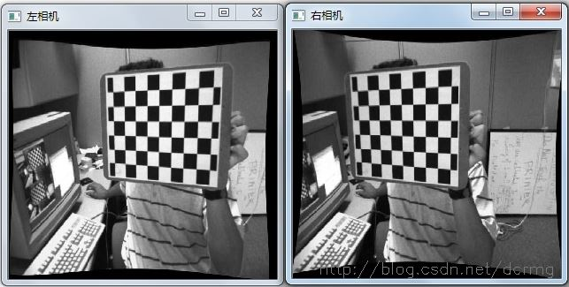

左右相机视差图：

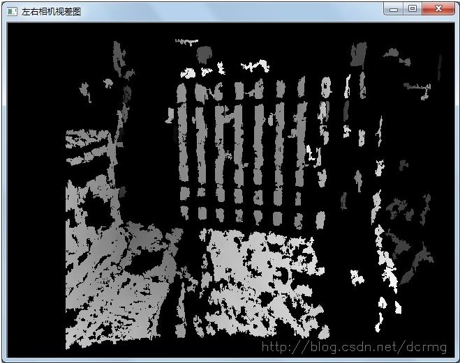

视差用亮度表示，越亮表示当前位置距离相机越远。
