**2019.3.21**

通过昨天的分析发现我们在市面上所能够买到的微透镜阵列的数目是比较少的，很难上百的。为此我们在进行光场成像的时候只是利用斯坦福光场进行成像是不能够实现高分辨率的重建的。为此考虑聚焦型光场相机的结构。

由于微透镜阵列是对主光学系统成的实像进行再成像，那么我可不可以将一个图片就放在微透镜阵列前面让他来成像。

按照文章中的zemax仿真结果来看，每一个小的透镜都能够进行聚焦，但是在我这里好像没有成功。

这是我仿真出来的，光线没有一点汇聚的可能。

---

**2019.3.20**

昨天晚上一直尝试用微透镜阵列进行模拟，但是却也一直没有得到希望得到的内容。首先，模拟的像有的时候出不来，其次，模拟的结果不会出现宏像素块那样。

思考：在对微透镜阵列进行理论分析的时候都是采用理想透镜，但是在进行仿真的时候是不会出现理想透镜的情况的，需要根据实际情况绘制出不同透镜的形状。

暂时可以考虑利用理想透镜来实现模拟，如果成功再采用理想透镜

利用理想微透镜阵列，只采用lens arrays一层面，而没有其他的内容。这个时候感觉微透镜阵列对光线没有任何作用，将微透镜阵列放置在理想透镜后面的成像位置处，可以发现此时的微透镜阵列对光线没有任何调试作用。是不是因为这只是一个面，没有指定他的材料那些。只利用一层面是不行的。

在这层面之前加上一层面，然后设置两个面之间的材料是quartz，如图

此时得到图形

虽然这个结果不是很理想，但是这个结果能够说明我们这个是微透镜阵列，而不像之前那样没有任何作用。但是也存在很多问题，和我们希望的结果不一样。

分析可以了解到，这里的微透镜阵列都是矩形的阵列，和我们所希望的圆形阵列是不一样的。因此不能采用默认的微透镜阵列的排列方式。

查看了一下手册中关于array的说明，如下。

这里可以知道每个微透镜阵列在这里的轮廓都是矩形的，但是形状是标准的。

下面的这两个方式都是在非序列模式下进行的

思考：矩形轮廓的话，会不会就得不到像文中那样的结果的。

对于上述的结果，我今天下午的时候发现，是我的结果出现的问题。通过这个方法是可以得到透镜阵列的，但是存在问题就是没有将所有的透镜进行成像，都只是对一部分的透镜阵列进行成像。成像结果肯定是满足不了我们的需求的。

通过对下图的观察得到的结果

该图我对微透镜的大小设置为$0.15*0.15$，数目设置为$60*60$，可以明显观察到这里没有60个宏像素存在，这是为什么呢？我看了下成像模拟下面的像尺寸，为$1.4223*1.9201mm$。然后我将成像面和透镜面拉近，得到上图中的结果。可以明显看到上面的图也进行了分区，分为很多个矩形的区域，可以发现矩形区域的数目和透镜大小以及像尺寸大小是对应的。那么分析结果就是，每个微透镜阵列都成像了，但是由于像尺寸的大小和微透镜没有全部成像的问题，导致一部分的微透镜没有得到使用。而且，每个微透镜阵列成像内容有点多，这个应该和真是使用的微透镜数目相关。

下面考虑，如何让所有的微透镜阵列都能够进行成像。

关于像尺寸：通过下面的图片可以知道， 像尺寸在很大程度上决定于第一个透镜的成像角度。成像角度越大，那么在后面成像芯片上的图像就很大。

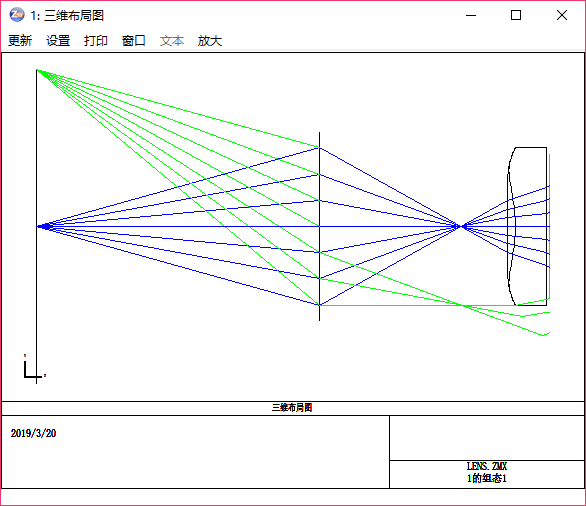

通过对系统的调整，发现像尺寸有所增加，但只是增加两倍之后并不能对整体分辨率有很大的提升。如果采用斯坦福光场来进行计算的话是肯定得不到想要的分辨率的。

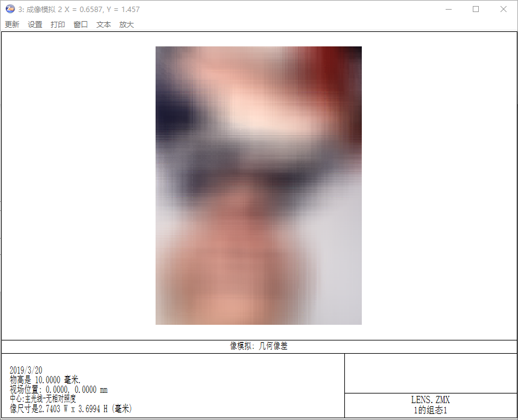

增加分辨率的方式还有一个就是减小微透镜的孔径，这样的话就可以得到更多的小孔的图像，增加了分辨率。

---

**2019.3.19**

这几天没有进行过程的记录，因为这几天都在对微透镜的原理进行学习和了解，现在大概了解了微透镜阵列的基本原理和两种微透镜阵列的成像方式。在学习的论文中用zemax进行了仿真，说明zemax是可以进行仿真的，今天的任务主要是学习zemax怎么进行仿真，以及能够得到基本的图像出来。

zemax2014的安装，由于之前安装的zemax2005不能满足日常使用的所有功能，为此开始尝试安装2009，但是我安装了很多次都没有成功，后来尝试安装2014，开始也没有成功，可能是破解的问题没有弄好，在其他网站重新找了一个下载的地方，之后成功破解。

[zemax2014安装包下载地址](www.xue51.com/soft/8171.html#xzdz)

1. 如何建立离线透镜，在面型里面选择paraxial，然后后面设置焦距大小就行了。

2. 如何建立像模拟平面，分析-图像模拟-图像模拟得到下面的图形
3. 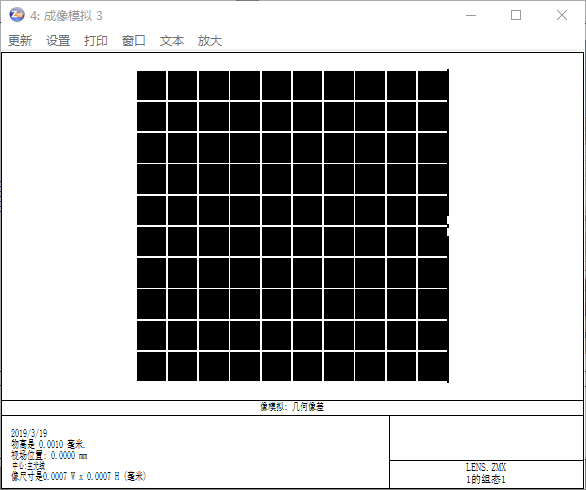

设置

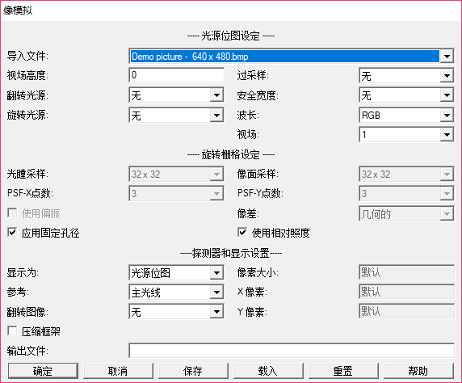

导入文件为你想要进行模拟的图像；视场高度必须进行设置，因为是对图像进行成像，不可能为0的视场高度存在。

关于视场高度的具体含义我目前也不是很清楚。

以下是利用理想透镜进行离焦成像的仿真

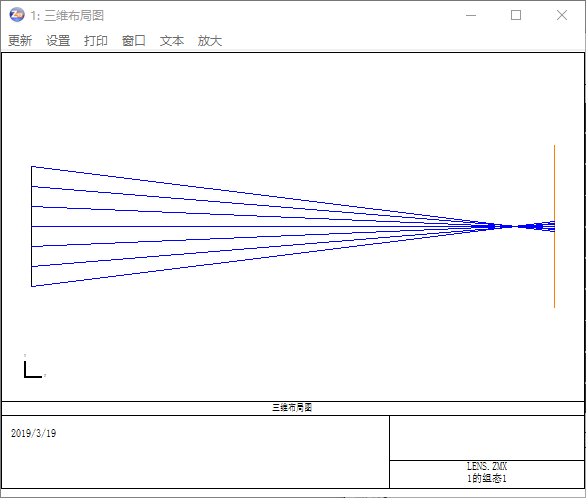

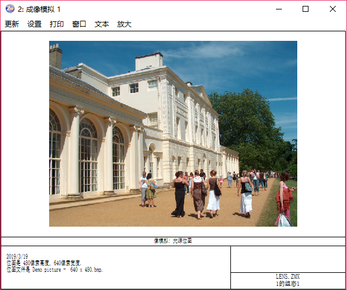

第一张为光路分析图，第二张为原图，第三者为离焦图

关于视场高度的问题，下面的图形进行了比较。发现像模拟的设置中的视场高度和最后成像的物高是一样的。那么视场高度很可能就是实际的物高。

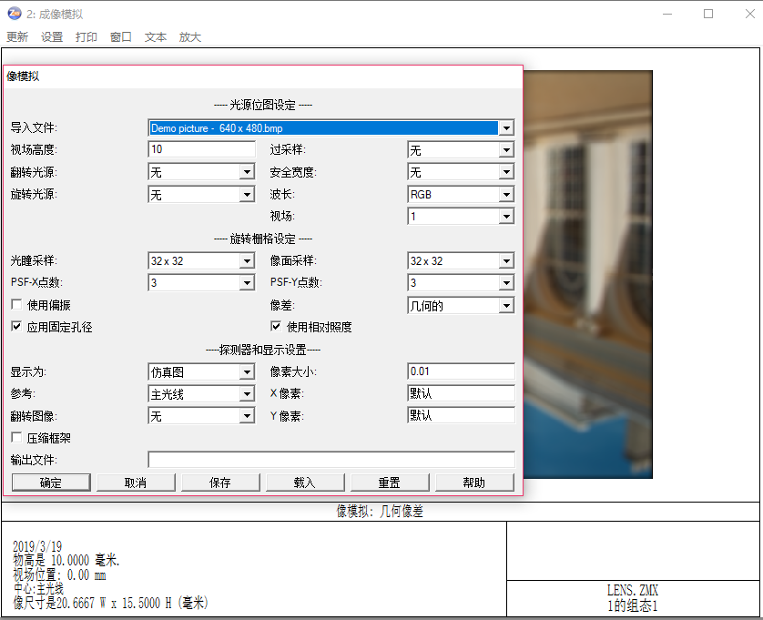

---

注意：在进行视场数据设置的时候，这个只是设置了你要模拟光线的视场高度。你在进行图像模拟的时候进行读取的时候，需要重新设置视场高度。这两个东西不是一起的。

试试单独对微透镜阵列进行模拟，发现得到的结果就不如人意，难怪光场相机结果不好。

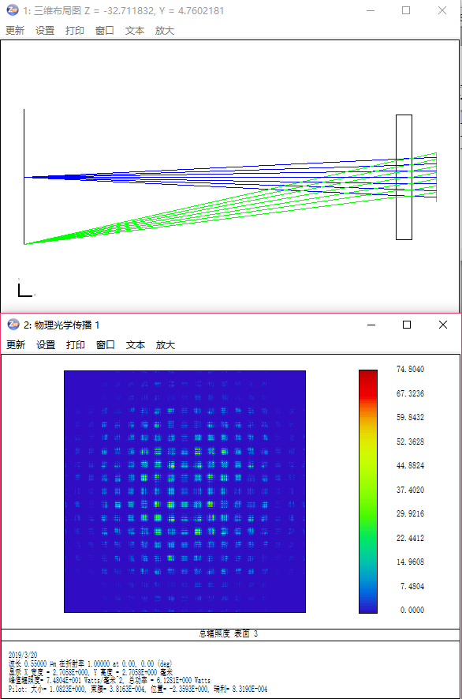

由平行光进行的入射最后的结果应该是点才对的

将探测器放在微透镜阵列后面的光线交汇点处时

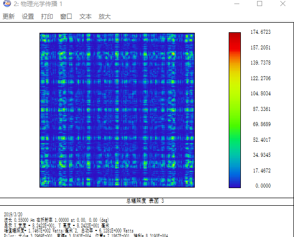

---

**2019.3.16**

继续研读微透镜成像原理的文献，深入了解微透镜的成像机理，为后面微透镜的选型等提供一定的准备知识。

---

**2019.3.15**

关于光场相机的几个问题，

1. 能否用微透镜阵列搭建光场相机
2. 微透镜阵列组中相邻的微透镜之间有没有光阑，防止两个不同透镜之间光线的相互干扰
3. 光场相机成像的分辨率问题，能否分辨我需要的像的内容，这里具体到能否对眼纹进行识别
4. 微透镜阵列的方形和圆形哪个具有光场成像的能力，以及他们的区别是什么，具体就是该如何进行选择

---

**2019.3.14**

上次在进行一定的比较后发现还是需要用学长这种的摄像头才行，如果是内窥镜的话，他的分辨率是一个比较大的问题，其次由于内窥镜都是需要打光来补偿光线不足的缺点的，因此内窥镜的方式目前就我们来说不是很合适。

在对学长的镜头进行打磨之后发现镜头的芯片板子在32mm上，两个镜头放在一起就是65mm左右，搭建这样一个双目系统，眼睛的侧下方进行拍摄会得到比较好的眼睛图像。              

希望后续能和老师进行一定的讨论， 确定这个方案，然后争取早点能够完成这个系统的搭建任务。

今天和老师说了，老师又说回了微透镜阵列。现在我已经没有追求了，就照老师说的弄把。为了其他方法已经耽误了这么久的时间感觉真的是不值得。就照着他的想法弄，最后出什么幺蛾子他也没有什么好说的了。

既然是要按照之前的方式来进行光学系统的搭建的话需要利用zemax对光学系统中的微透镜阵列进行仿真。看到有人利用lighttools和transcope进行仿真。

翻了一下zemax两本书籍并没有我所需要的内容，而且我这里对于光场相机的原理也不是很理解，决定先学习光场相机的原理。

[参考](https://blog.csdn.net/endlch/article/details/44539055)博客中利用matlab进行了光场相机的仿真。这里面提到的微透镜焦距远远小于主透镜的焦距，主透镜可以看作位于微透镜的无穷远处。光场相机中每个微透镜后面的图像是对原始数据进行求和得到的，因此一个微透镜也就成了最终的一个像素。

今天下载了tracepro，后面如果需要的话可以在这里进行仿真模拟。在网上找了一家比较正规的[透镜供应厂商](https://www.thorlabschina.cn/thorproduct.cfm?partnumber=MLA150-5C)。微透镜具有平凸外形，排列在方形网格中，透镜间距为150 µm或300 µm。间距为150 µm的微透镜阵列为圆形微透镜，而间距为300 µm的微透镜阵列为方形微透镜，填充系数为100%。

目前有方形的和圆形的透镜阵列，该如何取舍？？明天问一下透镜的相关人员把。以及如何进行仿真。

---

**2019.3.12**

经过一定的思考，我的任务重点应该不在搭建这个双目镜头组的实现上面。

昨天我稍微思考了学长微透镜阵列的搭建方法。该方法中将微透镜阵列放在主镜头的后面，首先就是不能将系统的直径缩小，其次就是像差问题。作为一个透镜来说，仅仅在近轴的光线才能够具有很好的成像质量，一旦光线近轴出现一定的夹角，作为一个透镜来说，一定是会出现像差的。然后就是学长的透光口径的问题，微透镜阵列的透光孔径是会相互影响的。一个物体发出的光线经过1微透镜进入可能会从其他透镜中出现。这样肯定会影响其他透镜的成像质量。

分析得到，在主透镜后面添加透镜组的方式是不合理的。只能是利用两个光学镜头分别进行成像，然后在同一个成像芯片上进行显示。该方法的作用是电脑只需要对一个镜头进行读取，无需在两个镜头之间来回进行切换。

为了说明计算机可以之间打开两个摄像头进行读取，[百度](https://jingyan.baidu.com/article/9158e000392cada25412281a.html)可知，利用opencv中函数就可以之间实现两个摄像头的读取方法。那么双镜头和双目的本质以及调用上并不会有特别大的影响，无非就是调用一个镜头还是调用两个镜头的问题。为此，我考虑能不能先从多个镜头入手，实现想要的内容。

在淘宝又找了几家的内窥镜，普遍存在一下几个问题。内窥镜的长度会比较长，内窥镜模组的芯片一般是顺着管道延展，所以内窥镜的长度一般会有3厘米以上，这样固定在眼镜上之后就会出现长长的相机突出。但是他的宽度一般在5mm左右，两个内窥镜进行并列放置的话面积不大，对视线的影响不大，遮挡相较于之前的会好很多。

今天和老师说一下吧，尽量用已经有的东西来解决这方面的问题。 

---

**2019.3.11**

昨天尝试了进行三段式的镜片处理，今天希望能够用淘宝上已经有的透镜搭建出一个简单的相机系统。

今天在想要实现镜头的时候发现镜头这里的问题实在太多了，不能简单的进行解决。像差过多，三片式镜头并不能很好的解决这中间存在的问题，而且我们的重点是后期的算法处理不是在镜头的搭建上面。如果镜头的像差美哟达到一个很好的效果，势必会对后面的图形计算造成很大的影响。

暂时放弃镜头的自己搭建。

进行方案寻找镜头，然后自己搭建成双目相机。尝试对医疗内窥镜入手。

但是学弟在csdn中找到一个zebase库，这个是已有的一些申请过专利的透镜组合。在其中选取一个内窥镜的光学系统进行仿真，得到很好的结果。其中的尺寸也比较小，这个纯光学系统直径可以保持在4mm。在物距为30mm的时候进行仿真，具有很好的成像效果。

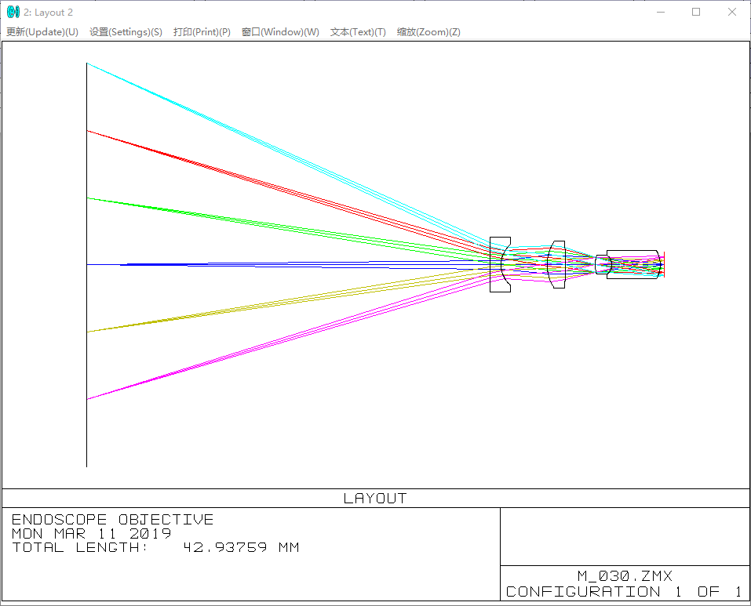

---

**2019.3.10**

这几天对zemax有了初步的理解，但是并没有成功的得到我们想要的镜头。之前也说过单一的透镜是不可能作为镜头来进行成像的，在透镜的近轴区可以看作是理想成像，但是在偏离镜头中心，或者说成一定角度进行入射的时候是肯定会出现像差的。我之前用已经有的镜头进行过像差的测试，在有一定角度的光线进行入射的时候是不会产生这样的结果的。

百度相机物镜镜头的设计，找到一个[设计案例](https://wenku.baidu.com/view/62bc6435c850ad02de804199.html)，学习一下。

下面的一个摄像机的镜头是在光学设计手册中找到的一个系统参数，我们可以参考这个系统的结构来对我们自己的系统进行设计。这是典型的三片透镜式。

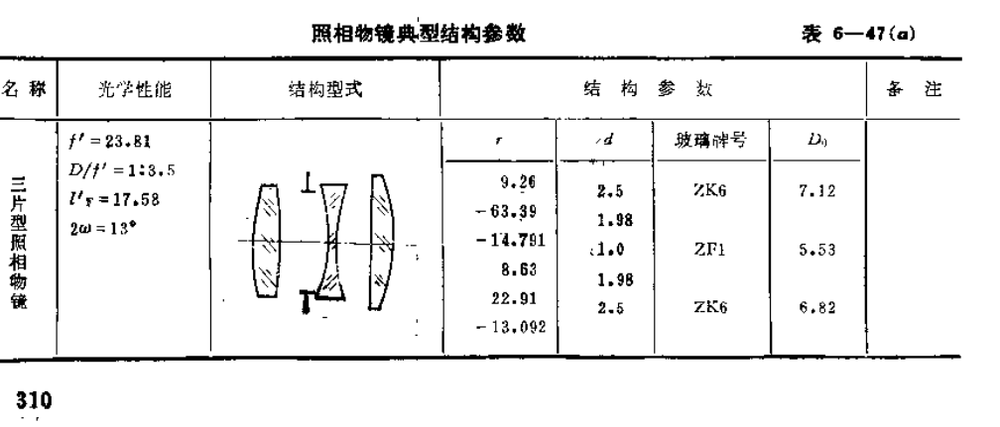

三片式透镜的设计过程参考[网址](https://wenku.baidu.com/view/300d91c667ec102de3bd8940.html?sxts=1552202736153)

上面三透镜的光学系统分析如下

平行光入射，大角度入射光会出现一定的像差。

但是如果是点光源光线的话就会有很长的像距，这里取物距为30mm，则模拟像距为110mm多如下

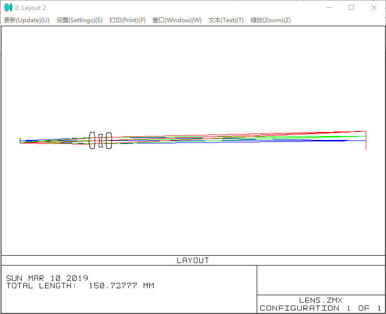

从上面的模拟可以发现，3个透镜的组合可以在一定程度上解决像差的问题。但是这里的焦距，物像等内容不符合我们的要求，为此需要对该透镜进行进一步的优化，达到我们的设计要求。下次的任务是进行优化。

---

**2019.3.8**

昨天对于简单的一个透镜的分析有了基本的了解，今天的主要任务是将其他的内容进行熟悉一下。

1. zemax中的透镜类型可以是standard，表示为标准类型，存在者像差等。也有paraxial，表示理想型透镜，不存在像差。

2. zemax中经常出现哑面的说法，这里认为应该是不透明的面，和透镜那些透光的面相对，比如成像面。

3. 在进行添加转折面的时候，发现在添加之后，二位的layout不能进行显示。但是在3维的layout中就能显示。

4. 在field中选择多个高度如下

   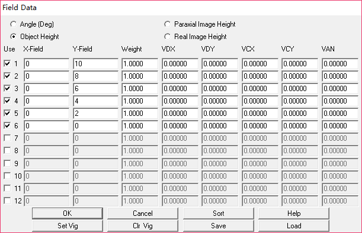

   对昨天的平凸透镜进行分析得到结果如下，取物距为2cm

   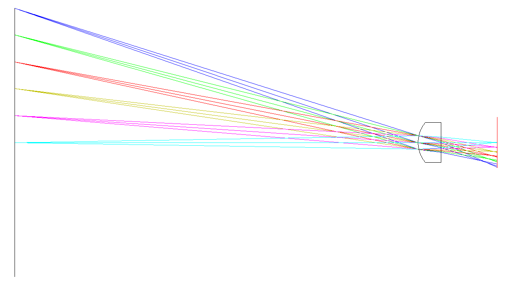

   结果分析，昨天的透镜在近轴光线得到的结果是比较好的。但是我们如果作为镜头的话，不可能只对近轴的光线进行分析。上图是对于一个2厘米的物体进行成像得到的结果，远离光轴的地方光线出现明显的色散现象。因此用这个透镜来进行成像是不能成功的。

---

** 2019.3.7**

昨天下午和晚上看电视去了，没有时间学习ZeMax相关的知识，今天学习一下，尽早把光路分析完善，之后再进行下一步的透镜装配。

下面对在光路设计中出现的光圈数百度后的结果，可以发现对于一个相机来说，F/#后面的数目是可以变的，代表的就是透光孔径变化。F为焦距，这里的#是光圈数，结果是入瞳大小。

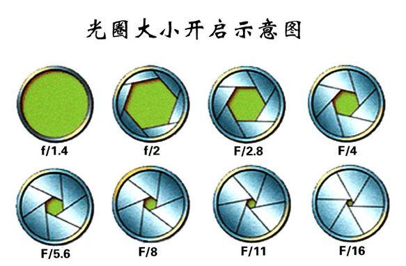

Zemax对透镜的光路分析

1. 双凸透镜，是直径2mm的那款，取入瞳孔径为0.5

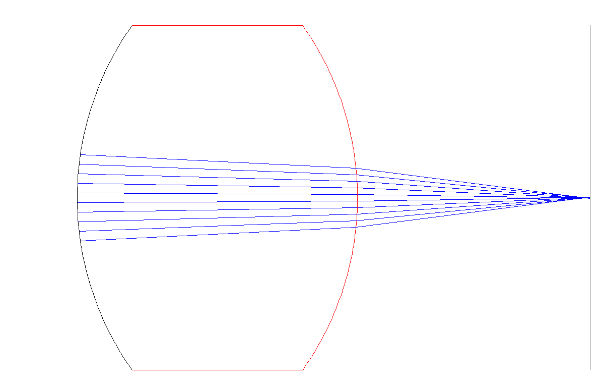

2. 直径3mm的平凸透镜，取入瞳孔径为1

入瞳孔径在比较小的时候能够满足像差比较小的要求，在入瞳孔径过于大的时候会出现轴向偏差。如下图，取入瞳孔径为1.5，在轴向出现偏差

Zemax的初步操作：zemax是一个从左到右依次进行设计的系统软件，首先是对光学系统的入瞳大小的确定，并确定入射光的角度和波长等，然后是对光学元件各个面的设计，最后是光路模拟。

---

**2019.3.6**

昨天在淘宝上看到的是一个4mm大小的相机，[4mm相机](https://item.taobao.com/item.htm?id=567662380992&price=120&sourceType=item&sourceType=item&suid=5403ce29-6405-4077-9431-2d85c25c508f&ut_sk=1.XCCtwIplz4ADAAU1908o9CAQ_21646297_1551775133634.TaoPassword-WeiXin.1&un=d636b38876734e9a28b5e1fb31f54c83&share_crt_v=1&sp_tk=77+lRVpYSGJ2Q1Q4bk/vv6U=&cpp=1&shareurl=true&spm=a313p.22.2bu.1015291715699&short_name=h.3Djxt6m&app=chrome)但是经过学弟询问发现是模拟信号，并且没有usb的输出口。

但是用两个一样的相机来进行搭建的方法是可行的，因为在询问以前同学的双目相机的时候发现存在两个usb的项目相机类型，那么就是通过两个完全一样的相机进行搭建的。

1. 继续进行寻找，看是否有符合我们要求的相机。自己进行组合，得到我们需要的双目相机类型。
2. 利用已有的相机进行分析，得到同一芯片上的双目相机。寻找小镜头，或者是寻找合理的光路组合。

和老师讨论后，又要我去在zemax中设计光路。这些东西应该就不是我来考虑的事情啊，直接将焦距和透镜直径告诉了不就好了。然后考虑透镜的像差就好了。感觉真的是很费。就算自己弄出来了，也没有地方给你去要这个东西的。还是先找到一个东西，然后对该模型进行仿真。

淘宝上找到一个[3mm平凸透镜](https://item.taobao.com/item.htm?spm=a1z10.5-c.w4002-17109880963.65.36914fe1RjoTZn&id=560644912787)

这里对这个透镜进行仿真，仿真没有问题后就买这个了，然后利用自己打印的框架来进行后续的结果。今天的任务就是学习Zemax仿真软件吧，不然老师真的不肯松口。

[Zemax教程](https://wenku.baidu.com/view/1e14025be87101f69e3195ab.html)

----------------

**2019.3.5**

关于成像系统的设计失败，没有在成像单元上得到想要的结果。透镜和框架如下图所示，其中正方形为摆放好的透镜阵列，这样的装置不能得到一个像结果出来。

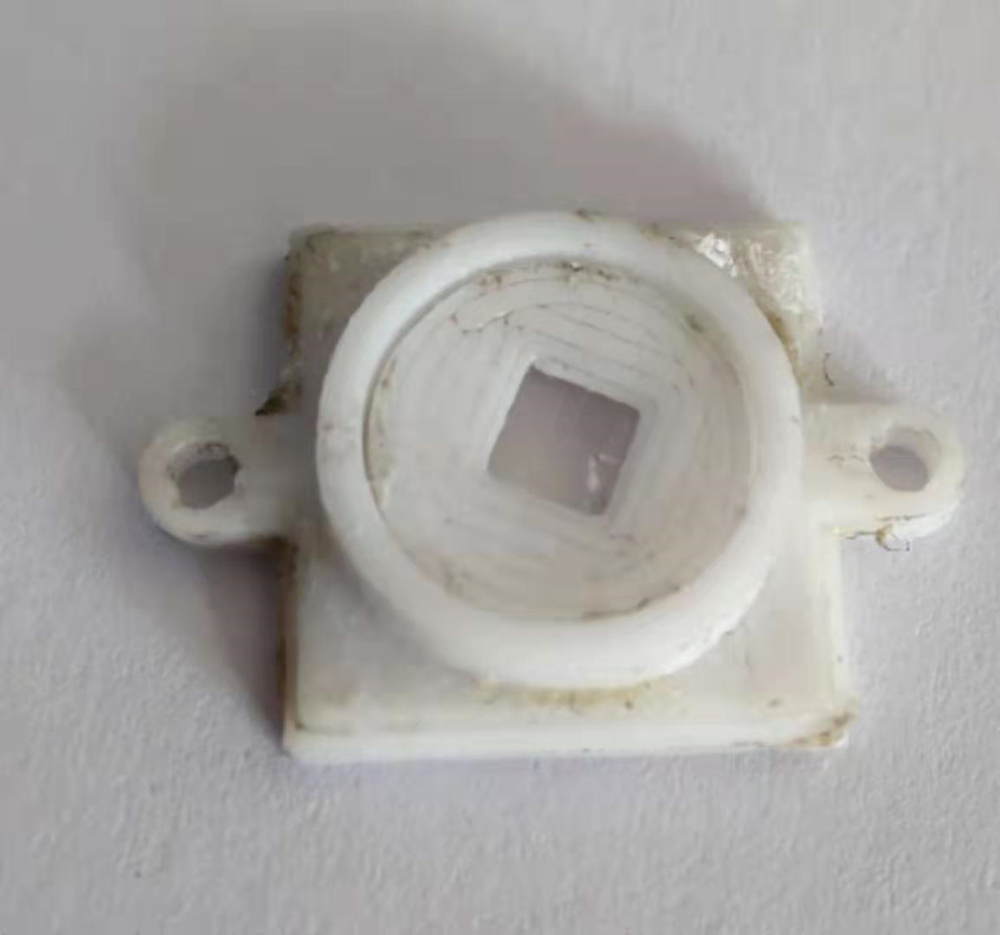

结果如下

分析：

针对上述情况进行分析，微透镜阵列能够对外部场景出现的光亮度变化做出反应。不同的亮度透过微透镜阵列能够得到一定的体现，但是得到的像特别模糊，而且特别暗淡。

1. 透镜的孔径很小，导致进入透镜和成像芯片上的光很少，难以满足成像芯片对光照的要求。（不同的成像芯片需要不同孔径的镜头？？）在利用手对已有的成像镜头进行遮挡，发现并不会出现上面的情况。孔径的大小，对成像质量的影响并没有想象的严重。
2. 焦距的问题，微透镜阵列没有将光线聚焦到一点。在利用已有镜头，将镜头和成像芯片的距离拉远，也会出现成像结果模糊的现象。而且分别对微透镜阵列和已有镜头进行聚光实验，发现微透镜阵列没有成功的将光线聚集在一个点上，为此考虑微透镜阵列没有聚焦的能力。或者说，微透镜阵列的聚集点在透镜内部，在外部无法找到该点。

对此放弃以前学长用的微透镜阵列，这里希望采用两个凸透镜进行组合在一起，得到我们需要的结果。

自己定制双透镜阵列。

但是双透镜阵列和成像之间又存在一定的差距，镜头并不是单一的凸透镜，为了消除像差，镜头中一般包括了很多组镜头的组合。为此只是单一的凸透镜并不能得到很好的成像结果。

如果想要实现双目透镜的话就需要进行镜头的设计。

-------------------------------------------------------------------------------------------------------------------------------------------------------

**2019.3.4**

修改透镜外的小框架尺寸，如下图

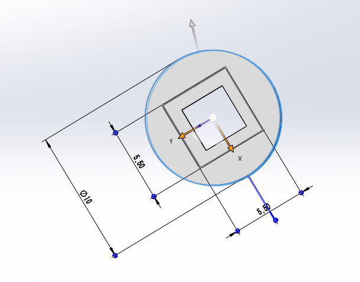

在此基础上拉伸一个2.5的凸台，然后在凸台底部，建立一个0.5的等距实体，拉伸0.5，用于遮挡光线用。因结构过于细腻，无法打印出螺纹来，因此这里不对螺纹进行表述，后期尽量不用螺纹进行连接。

相应的由于3d打印机的特殊，并不能对框架悬空的部分进行打印，而如果采取支架的方式可能会在一定程度上减小打印的质量，为此在外部框架的地方，一分为二。将悬空的部分进行分开打印，后续再进行组装的方式来避免悬空打印的结果。如下

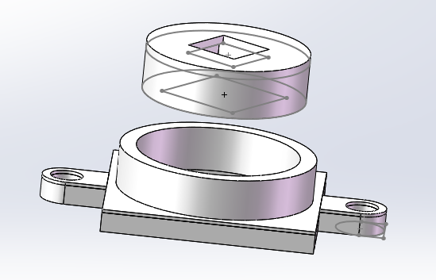

下面部分为已经组合好的外部框架。并对该轮廓的尺寸和内部进行对应修改。

注意：在3d打印的结果中需要保证打印结构具有一定的刚度，我在选取0.5作为边厚的时候就不能，结构软不能保证应有的形状。在选取1mm可保证结果的强度。

在打印过程中存在一定的热胀冷缩等情况，在进行配对的时候可能会出现不能对齐的情况。比如我这里的透镜框架和最外框架完全按照数据上进行配比，就不能完全严丝合缝的进行组合。这里出现装不进去的情况，就是孔小了。     设置0.5毫米的多余空隙，方便后续。

